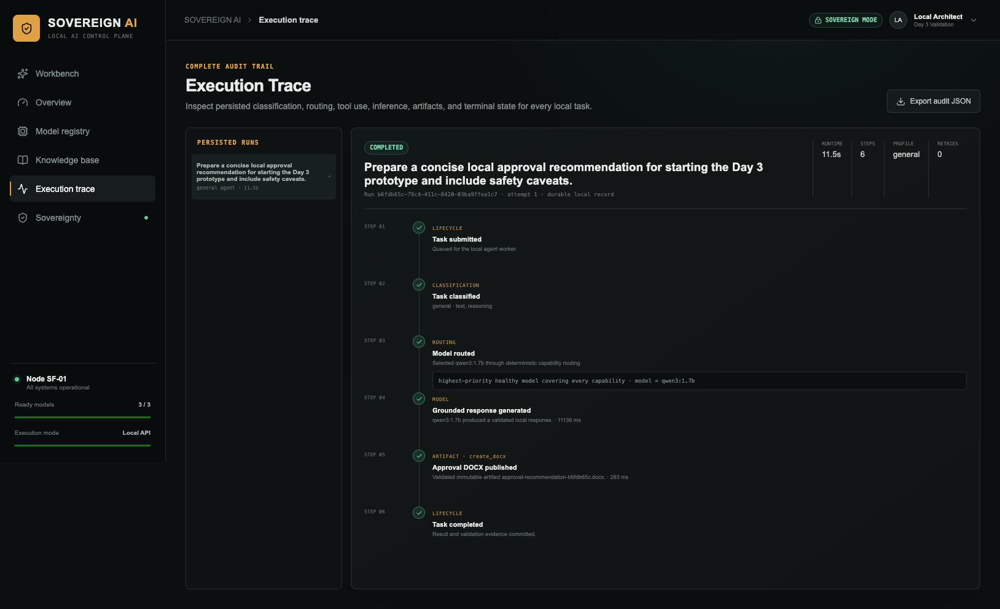
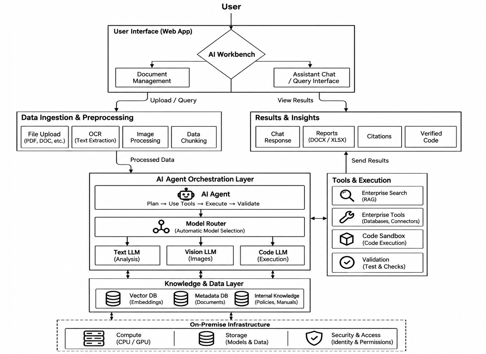
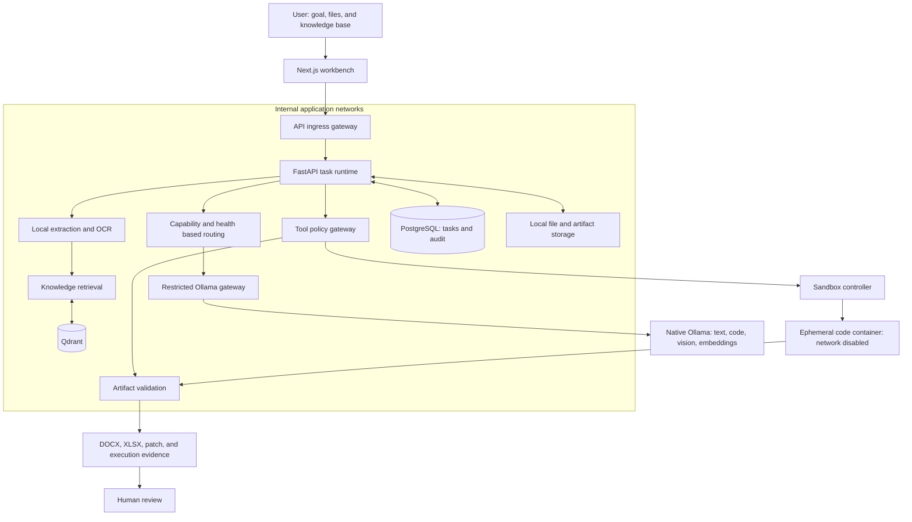

<p align="center">
  
</p>

<p align="center">
  <strong>Confidential industrial inputs. Local AI execution. Reviewable business outputs.</strong>
</p>

<p align="center">
  An on-premise agentic workbench that turns inspection reports, source code, and vendor quotations<br />
  into cited documents, test-checked patches, and formula-backed spreadsheets using local open-weight models.
</p>

<p align="center">
  <strong>Smart India Hackathon 2026 · SIH26117 · Team BOMBE · Team ID 144010</strong>
</p>

<p align="center">
  <a href="#recorded-demo-results">Demo evidence</a> ·
  <a href="#three-industrial-workflows">Workflows</a> ·
  <a href="#design-and-architecture">Design & architecture</a> ·
  <a href="#run-locally">Run locally</a> ·
  <a href="#security-and-sovereignty">Security boundaries</a>
</p>

**Start here:** inspect the [recorded acceptance results](demo/presentation-v1/output/acceptance-results.json), download the [generated inspection report](demo/presentation-v1/output/inspection-approval-recommendation-5411471a.docx), or open the [procurement workbook](demo/presentation-v1/output/procurement-procurement-comparison-7f567ba1.xlsx). These are committed application outputs from the synthetic demonstration dataset.

The prototype combines local inference with document retrieval, controlled tools, artifact validation, and an execution trace. Its central design rule: **models propose; software constrains execution and checks outputs; people approve consequential decisions.**

## Recorded demo results

The repository includes a recorded acceptance run for `presentation-v1.0.0`, with an outbound probe timestamp of **13 September 2026 (UTC)**. The record reports all three workflow runs and an overall `passed` status.

| Workflow | Recorded execution | Inspect the evidence |
|---|---|---|
| Inspection review | Qwen3 1.7B · 8 steps · 1 artifact | [Generated DOCX](demo/presentation-v1/output/inspection-approval-recommendation-5411471a.docx) · [Input and expected facts](demo/presentation-v1/01-inspection/expected.json) |
| Code repair | Qwen2.5-Coder 1.5B · 11 steps · 3 artifacts | [Run record](demo/presentation-v1/output/acceptance-results.json) · [Test fixture](demo/presentation-v1/02-coding/p101-temperature-monitor/test_monitor.py) · [Expected patch](demo/presentation-v1/02-coding/expected.patch) |
| Procurement comparison | Qwen3 1.7B · 7 steps · 2 artifacts | [Generated XLSX](demo/presentation-v1/output/procurement-procurement-comparison-7f567ba1.xlsx) · [Recommendation DOCX](demo/presentation-v1/output/procurement-procurement-recommendation-7f567ba1.docx) |
| API outbound probe | Connection to `https://example.com` recorded as `blocked` | [Probe result, target, and timestamp](demo/presentation-v1/output/acceptance-results.json) |

The three committed office outputs have SHA-256 checksums and `valid` statuses in the record. The coding run records three artifacts; its generated downloads are not bundled here, so the linked expected patch is a test fixture, not a captured model output.

**Evidence scope:** this is a recorded demonstration on synthetic data, not a broad accuracy benchmark or an independent security audit. Artifact validation checks specific structural and workflow requirements; human review remains necessary. The outbound probe observes one API-runtime connection attempt, not every process on the host.

<details>
<summary><strong>See an actual prototype execution trace</strong></summary>

<p align="center">
  
</p>

Historical prototype capture with earlier UI branding. This screenshot illustrates the persisted trace; its displayed timing is not a benchmark for the three workflows above.

</details>

## Three industrial workflows

The [demo pack](demo/presentation-v1/README.md) follows a fictional organization, **Aegis Process Systems**, through pump inspection, a monitoring-code repair, and replacement-part procurement. All inputs are synthetic and distributable.

| User and task | Inputs | Workbench output |
|---|---|---|
| **Maintenance engineer:** review pump P-101 | Inspection PDF, seal-leak image, and maintenance SOP | Draft inspection/approval DOCX grounded in retrieved evidence, for engineer review |
| **Software engineer:** fix the monitoring logic | Python repository ZIP with an intentional defect and tests | Candidate patch, repaired repository, and sandbox report, published after configured checks pass |
| **Procurement reviewer:** compare replacement-part bids | Quotation CSV and procurement-policy PDF | Formula-backed comparison XLSX and recommendation DOCX with policy checks |

For example, the procurement fixture includes a cheaper bid that fails lead-time and warranty requirements. Its expected recommendation is **Aravind Industrial**, demonstrating why policy compliance matters alongside price. Inspect the [ground truth](demo/presentation-v1/03-procurement/expected.json) and the generated workbook above.

## What makes the approach useful

- **Complete tasks through artifacts.** Workflows produce documents, spreadsheets, and code-repair deliverables that users can inspect and download.
- **Make routing explainable.** Task classification, capability requirements, model health, and priority determine model selection; the decision is recorded.
- **Keep evidence attached to the work.** Retrieval preserves document/page provenance, while task records retain steps, validation results, and artifact metadata.
- **Bound agent actions.** Tool profiles, fixed sandbox commands, resource limits, retries, and timeouts constrain execution.
- **Expose sovereignty evidence.** The Security screen combines configured controls with an explicit outbound probe and audit events, with the scope described below.

## Design and architecture



**Execution order: AI agent → model router → selected text, vision, or coding model.** Tools authorize and execute actions; the code model generates candidate changes and the sandbox runs them. The image is a conceptual view; the detailed design defines the actual service and trust boundaries.

The [production design package](docs/design/README.md) maps the current prototype to a supervised industrial deployment. It includes an inventory of all 36 current API routes, proposed production contracts, database evolution, frontend review flows, and measurable delivery gates. **These are implementation plans, not claims that the prototype is already production-ready.**

| Design area | What is specified |
|---|---|
| [System architecture](docs/design/architecture.md) | Component responsibilities, routing, independent workers, job recovery, deployment boundaries |
| [Backend and APIs](docs/design/backend-api.md) | Existing routes, proposed v2 contracts, permissions, idempotency, events, review and cancellation semantics |
| [Database and storage](docs/design/database.md) | Current schema, target ER model, tenant constraints, immutable revisions, migrations, retention and recovery |
| [Frontend design](docs/design/frontend.md) | Screens, task and review journeys, evidence previews, error states, accessibility, API integration |
| [Security design](docs/design/security.md) | Threat model, enterprise identity, sandbox isolation, network evidence, audit and secrets |
| [Operations and evaluation](docs/design/operations.md) | Offline deployment, capacity, monitoring, backups, model evaluation, incident response and release |
| [Production delivery plan](docs/design/delivery-plan.md) | Phased backlog, owner roles, dependencies, acceptance gates, risks and architecture decisions |

## How it works



The API worker uses internal Docker networks. Separate ingress and Ollama gateways handle browser/API access and local model requests. The sandbox controller is a distinct service with Docker-daemon access; the API worker does not mount the Docker socket.

| Layer | Current implementation |
|---|---|
| Interface | Next.js, React, TypeScript; Workbench, Knowledge, Models, Trace, and Security screens |
| API and orchestration | Python 3.12, FastAPI, Pydantic, SQLAlchemy; persisted task runtime and controlled tool registry |
| Local models | Ollama: `qwen3:1.7b`, `qwen2.5-coder:1.5b`, `gemma3:4b`, `nomic-embed-text` |
| Knowledge and storage | PostgreSQL 16, Qdrant, local file storage |
| Documents and artifacts | PyMuPDF, Tesseract, python-docx, openpyxl |
| Deployment and isolation | Docker Compose, dedicated sandbox controller, ephemeral code containers |

## Implementation status

| Available in the repository | Where to inspect |
|---|---|
| Local accounts, organization-scoped access, and session authentication | [Authentication service](backend/app/services/auth.py) · [Tests](backend/tests/test_auth.py) |
| Upload validation, PDF/OCR extraction, and versioned knowledge ingestion | [Extraction](backend/app/services/document_extraction.py) · [Ingestion](backend/app/services/knowledge_ingestion.py) |
| Deterministic model routing and governed task execution | [Router](backend/app/routing/router.py) · [Runtime](backend/app/tasks/runtime.py) · [Tool registry](backend/app/tools/registry.py) |
| Image/scan evidence with OCR and local vision processing | [Multimodal service](backend/app/services/multimodal.py) · [Tests](backend/tests/test_multimodal.py) |
| DOCX, procurement XLSX, and coding artifact pipelines | [Artifact implementations](backend/app/artifacts) · [Procurement tests](backend/tests/test_procurement.py) |
| Network-disabled code execution and checks | [Sandbox controller](sandbox-runner) · [Coding tests](backend/tests/test_coding.py) |
| Security dashboard, audit events, and API egress probe | [Security routes](backend/app/api/routes/security.py) · [Tests](backend/tests/test_security.py) |

Experimental constrained ReAct paths exist, but their coding, document, and multimodal feature flags are **off by default** in [.env.example](.env.example). The default workflows use the governed runtime; enabling experimental paths requires separate evaluation.

## Security and sovereignty

| Boundary | Implemented control | Scope and limitation |
|---|---|---|
| Model inference | Local Ollama adapter; `make ollama-serve` sets `OLLAMA_NO_CLOUD=1` | Initial dependency, image, and model downloads require connectivity |
| API worker | Internal Compose networks; restricted local-model gateway | The host and gateway/control-plane services are separate boundaries |
| Outbound evidence | API connection probe with timestamp and persisted result | A blocked probe is supporting evidence, not comprehensive zero-egress proof |
| Generated code | Non-root ephemeral containers, disabled networking, fixed commands, bounded resources | Sandbox controller has privileged Docker-daemon access |
| Data services | PostgreSQL on an internal network; Qdrant on the internal network plus a localhost-only port | Qdrant publishes `127.0.0.1:6333` in the current development configuration |
| Artifacts and access | Organization-scoped APIs, validation, checksums, and audit records | Successful checks do not establish complete semantic correctness |

See [docker-compose.yml](docker-compose.yml), the [Ollama gateway](backend/app/ollama_gateway.py), and [security tests](backend/tests/test_security.py) for implementation details. Enterprise deployment still requires hardened host isolation, credential management, and operational review.

## Run locally

The provided launch profile targets macOS/Apple Silicon with native Ollama. Defaults limit model concurrency to one request and one loaded model to accommodate constrained hardware; this is not a guaranteed memory or latency benchmark.

**Prerequisites:** Node.js 22.13+, npm, Python 3.12, `uv`, Docker Desktop or Colima with Docker Compose, and Ollama. Complete dependency and model downloads before attempting an offline demonstration.

```bash
git clone https://github.com/soumanpaul/SovereignForgeAI.git
cd SovereignForgeAI
make doctor
make setup
```

In terminal 1, start Ollama with the provided local-runtime settings. If Ollama is already serving, stop that instance before starting this one:

```bash
make ollama-serve
```

In terminal 2, download the models and start the application:

```bash
make ollama-models
make up
make status
```

Open **http://localhost:3000/signup** to create a local account, then use:

| Screen | Local URL |
|---|---|
| Workbench | http://localhost:3000/workbench |
| Knowledge | http://localhost:3000/knowledge |
| Execution trace | http://localhost:3000/trace |
| Security and sovereignty | http://localhost:3000/security |
| Interactive API documentation | http://localhost:8000/docs |

`make setup` creates `.env` from the example if needed. Compose uses `.env.example` as its API environment file by default; set `ENV_FILE=.env` when launching if you want API settings from your edited `.env`:

```bash
ENV_FILE=.env make up
```

For frontend hot reload, use `make dev`. To stop the Compose stack without deleting its data volumes, use `make down`. The [Makefile](Makefile) contains the launch and maintenance commands.

## Reproduce the demonstration

1. Create a local account and open **Knowledge**. Upload and index the [pump maintenance SOP](demo/presentation-v1/01-inspection/aegis-pump-maintenance-sop.pdf).
2. In **Workbench**, select the knowledge base, attach the [inspection report](demo/presentation-v1/01-inspection/aegis-p101-inspection-report.pdf) and [image](demo/presentation-v1/01-inspection/aegis-p101-seal-leak.jpg), then use the [inspection prompt](demo/presentation-v1/01-inspection/prompt.txt).
3. Inspect the execution trace and download the resulting DOCX.
4. Run the [coding prompt](demo/presentation-v1/02-coding/prompt.txt) with the [repository ZIP](demo/presentation-v1/02-coding/p101-temperature-monitor.zip).
5. Run the [procurement prompt](demo/presentation-v1/03-procurement/prompt.txt) with the [quotations](demo/presentation-v1/03-procurement/mechanical-seal-quotations.csv) and [policy](demo/presentation-v1/03-procurement/aegis-procurement-policy.pdf). Inspect both the XLSX and DOCX.

The [dataset manifest](demo/presentation-v1/manifest.json) identifies the fixtures. Expected-result JSON files provide scenario ground truth.

For an automated live run, use the [acceptance runner](demo/presentation-v1/run_acceptance.py) with a dedicated local demo account:

```bash
PRESENTATION_DEMO_EMAIL='presentation-v1@sovereignforge.local' \
PRESENTATION_DEMO_PASSWORD='<your-local-demo-password>' \
backend/.venv/bin/python demo/presentation-v1/run_acceptance.py
```

This command creates application demo data and writes downloaded artifacts and results into the demo output directory. The runner checks model readiness, workflow completion, artifact validation/checksums, and selected office-content requirements. Inspect its assertions for the exact acceptance scope.

## Development checks

```bash
make check
npm run build
```

These commands run the configured lint, type, test, and build checks. Live acceptance above additionally requires running services and downloaded models; unit tests alone do not establish real-model quality.

## Next milestones

See the [phased production delivery plan](docs/design/delivery-plan.md) for work packages, dependencies, and release gates.

- Publish repeatable latency, peak-memory, and task-success measurements across a larger corpus.
- Expand evaluation for poor scans, conflicting sources, prompt injection, and unsupported requests.
- Extend network evidence beyond the current API probe and code-container boundary.
- Add enterprise identity integration and harden sandbox-controller deployment.
- Conduct a supervised departmental pilot and measure time saved including human review.

The current deliverable is a competition prototype with inspectable workflow evidence. Enterprise readiness and broad task accuracy remain work to validate.

## Repository map

```text
frontend/              Workbench and supporting Next.js screens
backend/               API, routing, tools, artifacts, migrations, tests
sandbox-image/         Generated-code execution image
sandbox-runner/        Ephemeral-container controller
demo/presentation-v1/  Synthetic inputs, expected results, recorded outputs
docs/assets/           Project artwork
Makefile               Setup, runtime, and verification commands
docker-compose.yml     Application network and service configuration
```

**Built by Team BOMBE for SIH26117:** Sovereign On-Premise Agentic AI Workbench using Open-Weight Multimodal LLMs for Confidential Industrial Work.

No license file is included; the repository does not currently grant an open-source license.
