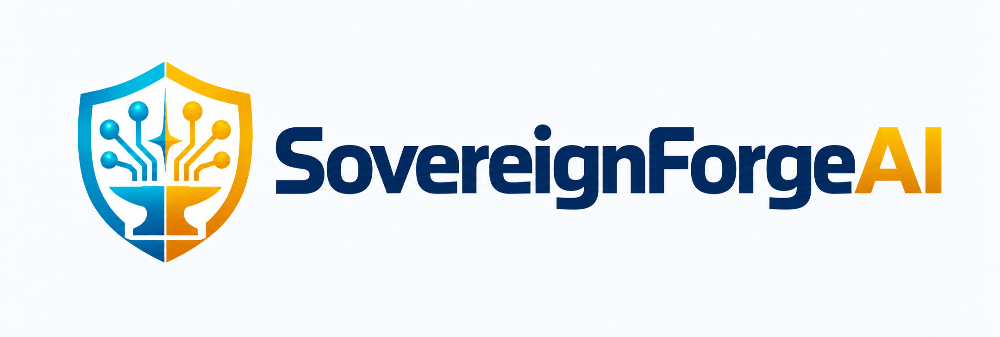
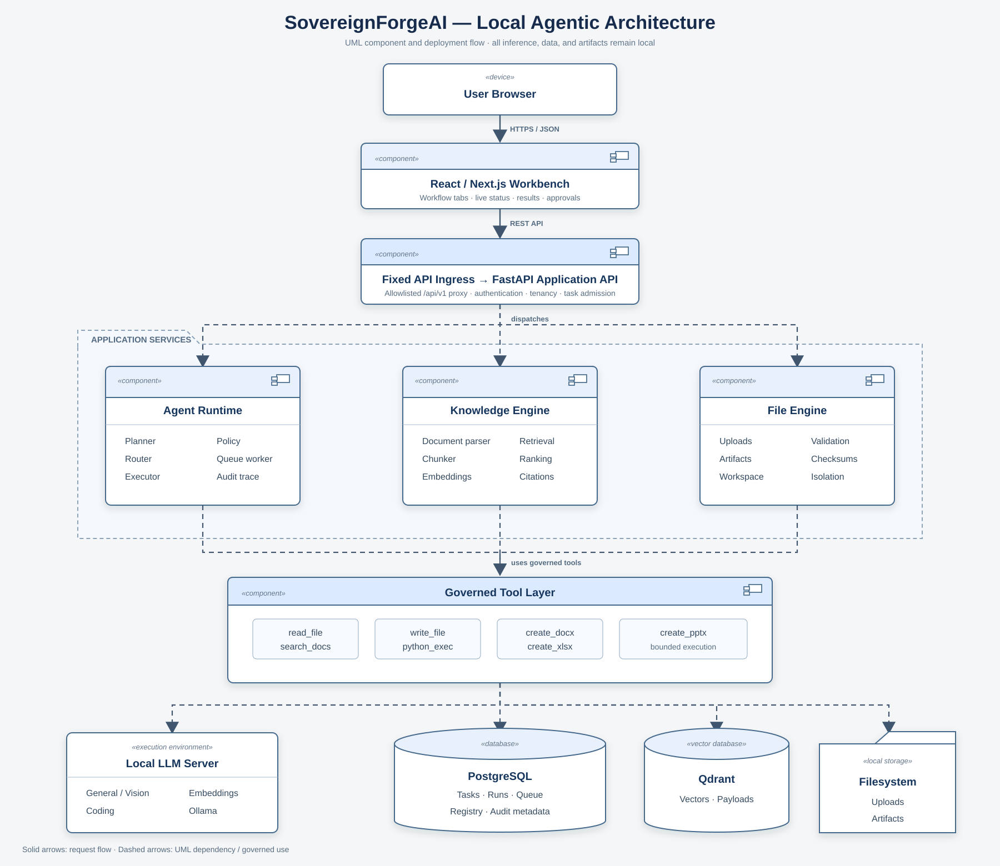

<p align="center">
  
</p>

<p align="center">
  <strong>Secure, local-first agentic AI for confidential industrial work.</strong>
</p>

<p align="center">
  Process sensitive documents, search internal knowledge, route work across local models,
  and evolve toward governed tool execution—without making a cloud AI service part of the runtime.
</p>

<p align="center">
  
  
  
  
  
</p>

> [!IMPORTANT]
> SovereignForgeAI is an actively developed competition prototype, not a production-certified platform. The current repository proves local knowledge, governed document agents, and a network-disabled coding-agent vertical slice. Human review is still required before using generated artifacts or patches in production.

## What is SovereignForgeAI?

SovereignForgeAI is an on-premise AI workbench for teams that cannot send inspection reports, maintenance procedures, source code, procurement records, or other confidential material to public AI services.

The platform combines local open-weight models with secure file handling, offline document extraction, versioned vector search, and evidence-linked results. Its target design adds deterministic model routing, bounded agent loops, allowlisted tools, isolated code execution, validated office artifacts, and inspectable sovereignty evidence.

The guiding rule is simple: **probabilistic models may propose; deterministic software must authorize, constrain, and verify.**

## Why it exists

Industrial AI adoption is often blocked by four practical concerns:

- sensitive data must remain under organizational control;
- answers must be grounded in approved internal material;
- model-selected actions need strict tool, path, time, and network boundaries;
- outputs need evidence, provenance, and objective completion checks.

SovereignForgeAI treats those concerns as product capabilities rather than deployment assumptions.

## Current capabilities

| Capability | Status | Evidence in this repository |
|---|---|---|
| Next.js workbench and FastAPI API | Available | Dashboard, Workbench, Models, and Knowledge screens |
| Local Ollama integration | Available | Provider-neutral adapter, health checks, and local inference |
| Secure local uploads | Available | Streamed size limits, generated storage keys, path containment, and type validation |
| Document extraction | Available | PDF text extraction, page-level Tesseract OCR fallback, text/Markdown/CSV/image support |
| Local knowledge indexing | Available | Deterministic chunks, local embeddings, Qdrant vectors, staged index activation |
| Cited semantic retrieval | Available | Workspace- and version-scoped results with document and page provenance |
| Durable task runtime and model router | Available | Persisted tasks/runs/steps, bounded retries, deterministic routing |
| Tool policy gateway and audit trace | Available | Profile allowlists, default deny, task-aware Trace UI and audit JSON |
| Network-disabled coding sandbox | Available | Ephemeral non-root containers, fixed commands, limits, active egress probe |
| DOCX artifact pipeline | Available | Markdown-aware generated document, validation, checksum, and trademark footer |
| Coding artifacts | Available | Verified patch, repository ZIP, and sandbox evidence JSON |
| Multimodal evidence pipeline | Available | OCR plus local vision analysis, normalized page evidence, and explicit fallback trace |
| XLSX artifact pipeline | Available | Formula-backed procurement workbook, structural validation, checksum, and trace |
| Sovereignty Center and egress proof | Planned | Evidence model and negative security tests are specified |

## Target workflows

1. **Industrial inspection review** — combine reports, equipment imagery, and approved SOPs to produce cited maintenance recommendations.
2. **Safe coding agent** — diagnose supplied code, propose a patch, and verify it inside an ephemeral network-disabled sandbox.
3. **Procurement decision support** — compare quotations against policy and produce traceable XLSX/DOCX decision artifacts.

The inspection, safe-coding, and procurement paths are implemented through Day 5.

## Architecture

SovereignForgeAI uses a modular-monolith application with replaceable local infrastructure adapters. PostgreSQL is authoritative for metadata, Qdrant stores document vectors, the local filesystem stores uploaded content, and native Ollama serves open-weight models. Docker keeps PostgreSQL and Qdrant on a private internal network.

<p align="center">
  
</p>

<p align="center"><sub>Target architecture. Components marked as planned in the capability table are not yet present in the Day 2 runtime.</sub></p>

### Technology stack

| Layer | Technology |
|---|---|
| Web application | Next.js, React, TypeScript |
| API | FastAPI, Pydantic, SQLAlchemy |
| Relational data | PostgreSQL 16 |
| Vector search | Qdrant |
| Local models | Ollama |
| Extraction and OCR | PyMuPDF, Tesseract |
| Orchestration | Turborepo, npm workspaces, `uv` |
| Code isolation | Dedicated sandbox controller and ephemeral Docker containers |
| Deployment | Docker Compose |

## Quick start

### Prerequisites

- macOS with Apple Silicon for the currently verified profile
- Docker Desktop or Colima with Docker Compose
- Node.js 22.13 or newer
- [`uv`](https://docs.astral.sh/uv/)
- [Ollama](https://ollama.com/) running natively for Metal acceleration

### Install and run

```bash
git clone <repository-url> sovereign-ai
cd sovereign-ai

make doctor
make setup
```

Start the restricted Ollama service in terminal 1:

```bash
make ollama-serve
```

Download the configured models once, then launch the application from terminal 2:

```bash
make ollama-models
make up
make status
```

Open the following local endpoints:

| Service | URL |
|---|---|
| Web application | <http://localhost:3000> |
| Knowledge workflow | <http://localhost:3000/knowledge> |
| Agent workbench | <http://localhost:3000/workbench> |
| Execution trace | <http://localhost:3000/trace> |
| FastAPI documentation | <http://localhost:8000/docs> |
| Readiness endpoint | <http://localhost:8000/api/v1/readiness> |

For full setup, migration, shutdown, and troubleshooting guidance, use the [Setup and Run Guide](docs/19-setup-and-run-guide.md).

### Frontend development with hot reload

Run the infrastructure and API in Docker while Next.js runs locally with Fast Refresh:

```bash
make dev
```

Keep the command running while editing files under `frontend/`. Press `Ctrl-C` to stop Next.js, then run `make down` when you also want to stop the supporting Docker services. Use `make up` for the production-style, fully containerized stack; frontend source changes require an image rebuild in that mode.

## Try the grounded-knowledge demo

1. Open <http://localhost:3000/knowledge>.
2. Upload [`demo-data/pump-maintenance-sop.md`](demo-data/pump-maintenance-sop.md).
3. Add the document to a knowledge base and wait for indexing to complete.
4. Search for:

```text
How do I safely isolate pump P-101 before maintenance?
```

The result should return relevant SOP evidence and cite `pump-maintenance-sop.md · p. 1`.

## Validation

Run the full repository quality gate and production build:

```bash
make check
npm run build
```

Check the running services:

```bash
curl http://localhost:8000/api/v1/health
curl http://localhost:8000/api/v1/readiness
```

The recorded workflow builds include end-to-end local acceptance evidence for the safe-coding and procurement paths. See the [Day 4 Build Record](docs/24-day-4-build-record.md) and [Day 5 Build Record](docs/25-day-5-build-record.md).

## API overview

| Method | Endpoint | Purpose |
|---|---|---|
| `GET` | `/api/v1/health` | API liveness |
| `GET` | `/api/v1/readiness` | PostgreSQL, Qdrant, and Ollama readiness |
| `GET` | `/api/v1/models` | List registered local models |
| `PATCH` | `/api/v1/models/{model_id}` | Owner-only enable or disable model routing |
| `POST` | `/api/v1/models/{model_id}/health-check` | Refresh model health |
| `POST` | `/api/v1/inference/chat` | Temporary foundation inference endpoint |
| `GET/POST` | `/api/v1/workspaces` | List or create workspaces |
| `GET/POST` | `/api/v1/workspaces/{id}/files` | List or securely upload files |
| `GET/POST` | `/api/v1/knowledge-bases` | List or create knowledge bases |
| `POST` | `/api/v1/knowledge-bases/{id}/ingestions` | Start staged versioned ingestion |
| `GET` | `/api/v1/ingestions/{id}` | Poll ingestion status |
| `POST` | `/api/v1/knowledge-bases/{id}/search` | Retrieve cited semantic matches |
| `GET/POST` | `/api/v1/tasks` | List or create governed document/coding tasks |
| `GET` | `/api/v1/tasks/{id}` | Read durable task, steps, result, and artifacts |
| `GET` | `/api/v1/artifacts/{id}/content` | Download an authorized immutable artifact |

The direct inference route remains a foundation/debug endpoint; user workflows use governed task APIs and deterministic model selection.

## Security and data-sovereignty posture

Implemented today:

- no cloud model provider is configured;
- Ollama is started with cloud features disabled by the provided Make target;
- PostgreSQL and Qdrant have no host-published ports and use a private Compose network;
- uploads use opaque server-generated storage keys and path-containment checks;
- PDF/image signatures, extensions, and upload size are validated;
- embeddings and inference are performed by local Ollama models;
- knowledge indexes activate a new version only after successful ingestion.
- generated code runs in an ephemeral non-root container with network disabled, a read-only repository, fixed commands, and bounded CPU, memory, PIDs, time, and output;
- the API has no Docker socket; an internal sandbox controller owns the privileged daemon boundary;
- source uploads remain immutable and code artifacts publish only after fixed verification passes.

Known boundary: the Day 4 proof covers generated-code containers, not every host process or Docker control-plane action. The Docker controller is a privileged prototype boundary that needs dedicated-host or micro-VM isolation for production. See [Security and Sovereignty](docs/08-security-and-sovereignty.md).

## Repository layout

```text
.
├── frontend/          Next.js application and frontend tests
├── backend/           FastAPI API, services, migrations, and tests
├── sandbox-image/     constrained generated-code runtime
├── sandbox-runner/    internal ephemeral-container controller
├── demo/              deterministic workflow fixtures
├── demo-data/         Deterministic local demonstration inputs
├── docs/              Product, architecture, security, and delivery source of truth
├── docker-compose.yml Local application and data-service topology
├── Makefile           Setup, model, runtime, and verification commands
└── package.json       Turborepo workspace orchestration
```

## Documentation

Start with the [Engineering Plan](docs/README.md), which indexes the complete specification set. Key references:

- [Product Charter](docs/01-product-charter.md)
- [Requirements and Acceptance Criteria](docs/02-requirements.md)
- [Features and Workflows](docs/03-features-and-workflows.md)
- [Software Architecture](docs/04-architecture.md)
- [Security and Sovereignty](docs/08-security-and-sovereignty.md)
- [Testing and Evaluation](docs/09-testing-and-evaluation.md)
- [Delivery Plan](docs/10-delivery-plan.md)
- [Proposed Solution](docs/18-proposed-solution.md)
- [Setup and Run Guide](docs/19-setup-and-run-guide.md)

## Roadmap

- **Day 1 — complete:** monorepo foundation, local model provider, registry, health, UI, and private data services.
- **Day 2 — complete:** secure ingestion, PDF/OCR extraction, versioned Qdrant indexing, and cited retrieval.
- **Day 3 — complete:** durable task state, deterministic routing, governed agent loop, hybrid evidence, DOCX, and trace events.
- **Day 4 — complete:** coding route, secure repository intake, network-disabled sandbox verification, retries, and code artifacts.
- **Day 5 — complete:** multimodal evidence normalization, procurement comparison, and validated DOCX/XLSX artifacts.
- **Day 6:** audit, sovereignty evidence, and negative security tests.
- **Day 7:** evaluation, offline rehearsal, packaging, and submission evidence.

## Contributing

Changes should preserve the documented trust boundaries and remain tied to requirements and acceptance evidence.

1. Read the [engineering standards](docs/15-technology-and-engineering-standards.md).
2. Create a focused branch and keep changes scoped.
3. Add or update tests for behavior changes.
4. Run `make check` and `npm run build`.
5. Update the affected design document, ADR, and traceability entries for material architecture or security changes.

## License

No license file is currently included. Treat the repository as all-rights-reserved until the project owners add an explicit license.
