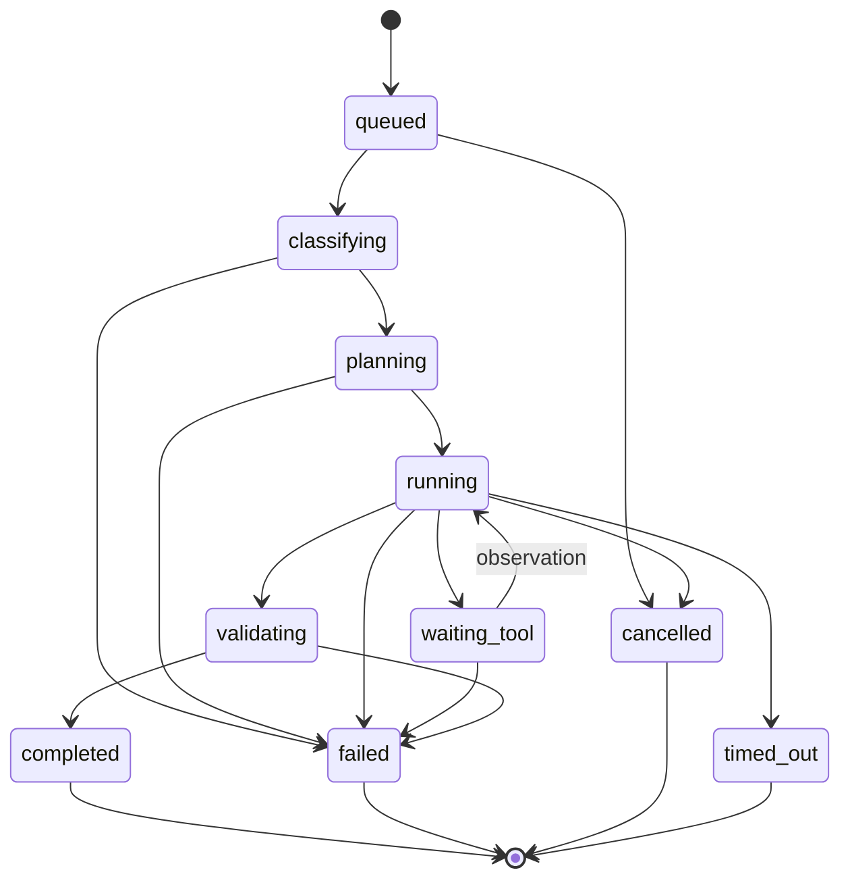

# Features and Workflows

## Feature catalog

| Feature | User value | MVP behavior | Not included |
|---|---|---|---|
| Workspaces | Groups confidential inputs and outputs | One operator, multiple isolated workspaces | Teams and sharing |
| Workbench | Runs an end-to-end task with visible progress | Files, prompt, route, steps, sources, artifacts | Free-form workflow design |
| Model registry | Makes local capability and health visible | View/configured models, load state, resource metadata | Model marketplace/fine-tuning |
| Knowledge bases | Grounds responses in internal policy | Upload, ingest, status, search, delete with confirmation | ACL sync and federated search |
| Execution trace | Explains agent behavior | Ordered steps, model/tool, timing, retries, errors | Distributed tracing UI |
| Code sandbox | Safely verifies generated changes | Python/test execution in ephemeral no-network container | Arbitrary languages/host shell |
| Artifact studio | Produces usable outputs | Template-based DOCX and XLSX | In-browser Office editing |
| Sovereignty center | Gives evidence of local isolation | topology, configuration, health, observed egress, test result | Formal compliance certification |

## Workflow A: industrial inspection review

### Preconditions

- Inspection PDF, equipment image and maintenance SOP are uploaded.
- SOP ingestion status is `indexed`.
- Vision/general model and embedding model are healthy.

### Happy path

1. User selects the three inputs and requests an approval note.
2. System classifies the task as `DOCUMENT_ANALYSIS` with `vision`, `rag`, `reasoning`, and `document_generation` capabilities.
3. Digital text extraction/OCR and image inspection execute locally.
4. Agent normalizes equipment ID, observations and confidence.
5. Retrieval searches the selected SOP and returns page/section evidence.
6. Reasoner compares findings to policy, identifies severity and cites evidence.
7. DOCX tool renders an approval note from validated structured data.
8. Artifact validator opens the package and confirms required sections.
9. UI shows result, citations, trace, artifact checksum and sovereignty evidence.

### Failure/edge behavior

- Unreadable page: record page error; continue only if required facts remain available.
- Low-confidence equipment identity: ask for human confirmation or mark `needs_review`.
- No relevant SOP evidence: do not invent a clause; produce a qualified draft requiring review.
- Vision model unavailable: fail clearly unless text-only processing can satisfy the task.

### Output contract

Equipment, observation, risk (`LOW|MEDIUM|HIGH|CRITICAL`), evidence citations, recommendation, assumptions, approval requested, and confidence/review flag.

## Workflow B: coding agent

### Preconditions

- Python source, test file and CSV fixture are present.
- Coding model and sandbox service are healthy.

### Happy path

1. User requests diagnosis, correction and verification.
2. Router selects `CODING` and a coding-capable model.
3. Read-only tools inspect the bounded uploaded workspace.
4. Agent proposes a plan and patch.
5. Patch is applied only to an ephemeral working copy.
6. Sandbox runs tests with no network and strict resource limits.
7. On recoverable failure, agent observes output and retries within policy.
8. On success, system publishes patch, modified file and test evidence as artifacts.

### Failure/edge behavior

- No tests: run an explicit verification command/fixture and label coverage limitation.
- Unsafe dependency/network request: deny it and show a policy failure.
- Tests still fail at retry limit: return the best diagnosis and failed evidence; do not claim success.
- Excess output or timeout: terminate sandbox and mark categorized error.

## Workflow C: procurement analysis

### Preconditions

- Three quotations and procurement policy are uploaded/indexed.
- General model, embedding model and spreadsheet generator are healthy.

### Happy path

1. Extract vendor, price, warranty, delivery and compliance statements per source.
2. Normalize currencies/units without losing original values.
3. Retrieve applicable procurement rules and cite them.
4. Compare using explicit criteria; distinguish facts from recommendation.
5. Generate a formatted XLSX comparison and DOCX recommendation.
6. Validate both files and display provenance.

### Failure/edge behavior

- Missing vendor field remains `Not provided`; it is not imputed.
- Conflicting values retain both source references and require review.
- Recommendation criteria and weights are shown; ties are not arbitrarily broken.

## Shared run lifecycle

## UX principles

- Show actual execution states, never animated fictional steps.
- Keep source evidence beside claims and artifacts.
- Distinguish model reasoning summaries from tool-observed facts.
- Use `blocked`, `unknown`, `unavailable`, and `not measured` precisely.
- Require confirmation for knowledge-base deletion; uploads and task execution are reversible.
