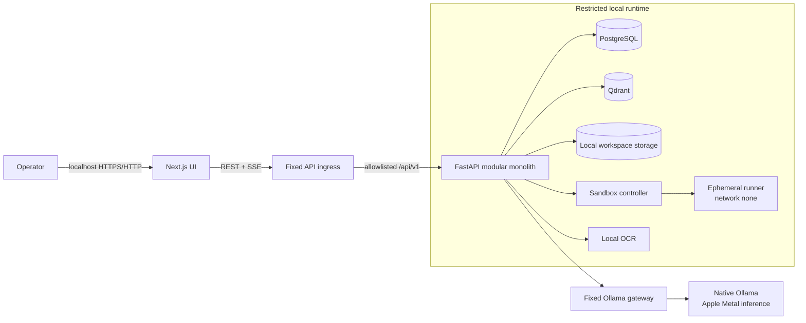

# Software Architecture

## Architectural style

Use a **modular monolith** for the application and separate infrastructure processes for model serving, vector storage, relational storage, and sandbox execution. This gives strong code boundaries and replaceable adapters without the operational cost of microservices during a seven-day build.

## Architecture drivers

1. Verifiable local data processing and blocked runtime egress.
2. Safe execution of model-selected tools.
3. Traceable, restart-tolerant multi-step runs.
4. Capability routing across heterogeneous local models.
5. Fast delivery on one workstation.
6. Real, validated office artifacts.

## Container view

## Backend modules

| Module | Responsibility | Must not own |
|---|---|---|
| `api` | HTTP contracts, auth placeholder, request/response mapping | business orchestration |
| `tasks` | Task/run lifecycle, queueing, cancellation | model-specific calls |
| `agents` | planning loop, bounded state transitions | direct filesystem or subprocess access |
| `routing` | task classification, capability resolution, scoring | tool authorization |
| `model_providers` | Ollama adapter and provider-neutral contracts | workflow decisions |
| `tools` | registry, schemas, policy gateway, result envelope | unrestricted host calls |
| `documents` | validation, parsing, OCR, normalized page model | vector persistence details |
| `rag` | chunking, embeddings, indexing, retrieval, citations | raw upload authorization |
| `sandbox` | isolated execution request/control/evidence | agent reasoning |
| `artifacts` | render, validate, checksum, publish | task planning |
| `audit` | append-only event creation/query | mutable domain state |
| `security` | paths, policy, redaction, sovereignty probes | UI-only enforcement |

## Data ownership

- PostgreSQL: workspaces, metadata, configurations, task state, durable steps, artifact metadata, audit events.
- Qdrant: chunk vectors plus minimal retrieval metadata and stable chunk IDs.
- Filesystem: uploads, normalized extracts, sandbox inputs/outputs, published artifacts.
- Ollama: model weights/cache; not an application system of record.
- Browser: transient UI/query state only; never authoritative execution state.

## Deployment topology

The M1 8 GB prototype runs Ollama natively on macOS for Apple Metal acceleration. Docker Compose runs the frontend, fixed-purpose gateways, API, PostgreSQL, Qdrant, and sandbox controller. It creates:

- `ingress_net`: the browser-facing Next.js UI can reach only the fixed-upstream API ingress.
- `app_net` with `internal: true`: the ingress, API, and fixed-upstream Ollama gateway communicate privately.
- `data_net` with `internal: true`: only the API, PostgreSQL, Qdrant, and optional pgAdmin share the data plane.
- `sandbox_control_net` with `internal: true`: only the API and sandbox controller communicate.
- `ollama_host_net`: only the allowlisted Ollama gateway has the host route required for native Apple Metal inference.

The API worker has no general egress route. Browser traffic enters through a fixed internal upstream, and model traffic exits through a gateway that exposes only the Ollama tag, chat, and embedding operations. The sovereignty probe records the observed result; the UI claims runtime isolation only when configuration and a blocked live probe agree.

The ephemeral sandbox uses `network_mode: none`, read-only base image, non-root user, dropped capabilities, memory/CPU/PID limits, and only a task-specific temporary mount. Production hardening may add seccomp/AppArmor and a dedicated runner host.

## Synchronous and asynchronous work

- Metadata reads, health and task creation return synchronously.
- Ingestion and agent runs execute as background jobs.
- For the prototype, a database-backed in-process worker with a single concurrency slot is acceptable.
- The API exposes ordered events via SSE; polling is the fallback.
- On process restart, `running` jobs become `interrupted` and may be explicitly retried from a safe checkpoint. Do not pretend exactly-once execution.

## Key design decisions

- Deterministic rules derive required capabilities; an LLM may assist classification only behind validated output and fixture tests.
- Model selection scoring is deterministic and auditable.
- Model output is untrusted data. It must pass schema, permission and path validation before a tool runs.
- Templates receive structured content, not arbitrary generated file-manipulation code.
- Published artifacts are immutable and content-addressed by SHA-256 metadata.
- Audit events are append-only at application level.

## Evolution path

If load or organizational requirements justify it, extract the worker/sandbox controller, replace in-process scheduling with a durable queue, introduce OIDC/RBAC, put object storage behind the file interface, and use vLLM/TGI behind the same provider interface. These are seams, not prototype commitments.
