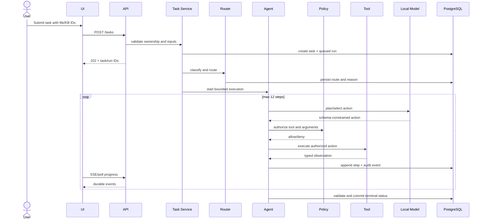
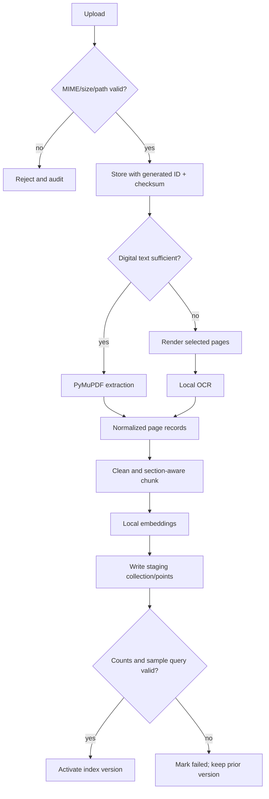
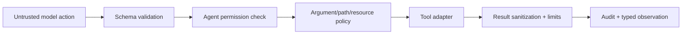

# System Design

## End-to-end task sequence



## Knowledge ingestion



Chunk defaults: 700 tokens, 100-token overlap, split on headings/paragraphs where possible. These are configuration defaults and must be evaluated on the demo corpus. Every chunk retains document ID, checksum, page range, section, extraction method and index version.

## Retrieval and grounded generation

1. Validate workspace and selected knowledge base.
2. Embed normalized query using the registered local embedding model.
3. Search top 12 vectors with workspace/KB/version filters.
4. Deduplicate near-identical chunks and optionally rerank locally.
5. Select up to 5 chunks within context budget.
6. Generate structured answer with citation IDs restricted to supplied chunks.
7. Reject unknown citation IDs; map valid IDs to page/section links.
8. If evidence score/coverage is insufficient, return `needs_review` or abstain.

## Routing design

Required capabilities are produced from task type and inputs. Candidate models are hard-filtered by enabled state, health freshness, capability coverage and input size. Remaining models score as:

```text
score = priority
      + 20 * exact_task_specialization
      + 10 * warm_or_loaded
      + 10 * context_fit_margin
      - estimated_resource_pressure
```

Tie-break order is stable: higher score, lower configured cost class, then lexical model ID. Persist required capabilities, candidates, exclusions, scores and selected model.

## Tool execution boundary



No tool accepts a raw shell string. Commands are server-defined executable/argument arrays. File tools resolve server IDs to canonical paths and re-check containment after resolution.

## Artifact publication

Agent produces a schema-validated `ArtifactSpec`. The renderer writes to a temporary path, validates the package and required sections/sheets, calculates SHA-256, moves the file to immutable workspace artifact storage, and commits metadata. Failure before commit leaves no published artifact.

## Failure taxonomy

| Category | Examples | Handling |
|---|---|---|
| `validation` | bad MIME, missing ID, invalid schema | no retry; clear user correction |
| `policy_denied` | unauthorized tool/path/network | no retry unless plan selects an allowed action |
| `dependency_unavailable` | model/Qdrant/OCR unhealthy | bounded retry or capable fallback |
| `model_output_invalid` | malformed action/citation | one repair attempt, then fail safely |
| `tool_transient` | temporary read/DB contention | exponential bounded retry |
| `sandbox_failure` | tests fail, timeout, resource kill | return evidence; retry only if agent can change solution |
| `internal` | unexpected invariant violation | fail run, correlation ID, redacted log |

## Capacity assumptions

The prototype schedules one generation-heavy run at a time to avoid VRAM contention. Upload and metadata operations may remain concurrent. Queue position is visible. Resource metrics are best-effort and show `unknown` when the host/provider cannot expose them.
