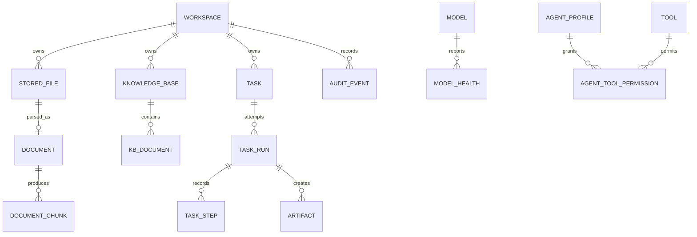

# Data and API Design

## Relational model

All primary keys are UUIDs; timestamps are UTC; mutable rows include `created_at`, `updated_at`, and where necessary an optimistic `version`.



## Core tables

| Table | Important columns |
|---|---|
| `workspaces` | `id`, `name`, `status` |
| `stored_files` | `id`, `workspace_id`, `display_name`, `storage_key`, `media_type`, `size`, `sha256`, `status` |
| `documents` | `id`, `file_id`, `page_count`, `extraction_status`, `extractor_version`, `warnings_json` |
| `knowledge_bases` | `id`, `workspace_id`, `name`, `active_index_version`, `status` |
| `kb_documents` | `knowledge_base_id`, `document_id`, `index_version`, `status` |
| `document_chunks` | `id`, `document_id`, `index_version`, `page_start/end`, `section`, `text_hash`, `vector_point_id` |
| `models` | `id`, `name`, `provider`, `model_key`, `capabilities_json`, `context_window`, `quantization`, `priority`, `enabled`, `config_json` |
| `model_health` | `id`, `model_id`, `status`, `observed_at`, `latency_ms`, `details_json` |
| `tasks` | `id`, `workspace_id`, `goal`, `task_type`, `input_json`, `status` |
| `task_runs` | `id`, `task_id`, `attempt`, `status`, `model_id`, `route_json`, `deadline_at`, counters, terminal error |
| `task_steps` | `id`, `run_id`, `sequence`, `kind`, `status`, `tool_name`, bounded input/output JSON, timing/error |
| `artifacts` | `id`, `workspace_id`, `run_id`, `logical_name`, `revision`, `storage_key`, `media_type`, `size`, `sha256`, validation status |
| `tools` | `name`, `version`, `description`, `input_schema_json`, `enabled` |
| `agent_profiles` | `id`, `name`, `max_steps`, `timeouts_json` |
| `agent_tool_permissions` | `agent_profile_id`, `tool_name`, `constraints_json` |
| `audit_events` | `id`, `workspace_id`, `run_id`, `event_type`, `actor_type/id`, `occurred_at`, redacted `payload_json`, hash metadata |

Add indexes on workspace/status/timestamps, `(run_id, sequence)` unique, file checksum, task status, audit run/timestamp, and document/version. Vector content lives in Qdrant; relational chunk rows support provenance and lifecycle.

## API conventions

- Prefix: `/api/v1`.
- JSON uses `snake_case`; timestamps are RFC 3339 UTC.
- Long operations return `202 Accepted` with resource and status URLs.
- Pagination is cursor-based: `?limit=50&cursor=...`.
- Mutation requests accept `Idempotency-Key` where retry duplication matters.
- Errors use the common envelope in the LLD.
- Downloads use opaque artifact/file IDs, never client paths.

## Endpoint baseline

| Method/path | Purpose | Response |
|---|---|---|
| `POST /workspaces` | Create workspace | `201 Workspace` |
| `GET /workspaces/{id}` | Workspace summary | `200 Workspace` |
| `POST /workspaces/{id}/files` | Multipart upload | `201 StoredFile` |
| `GET /workspaces/{id}/files` | List files | `200 Page[StoredFile]` |
| `GET /files/{id}/content` | Download authorized file | streamed content |
| `POST /knowledge-bases` | Create KB | `201 KnowledgeBase` |
| `GET /knowledge-bases?workspace_id={id}` | List workspace knowledge bases | `200 KnowledgeBase[]` |
| `POST /knowledge-bases/{id}/ingestions` | Stage a new full-set index version | `202 IngestionJob` |
| `GET /ingestions/{id}` | Poll ingestion status/errors | `200 IngestionJob` |
| `POST /knowledge-bases/{id}/search` | Debug/test retrieval | `200 SearchResult[]` |
| `POST /tasks` | Create and queue task | `202 Task` |
| `GET /tasks/{id}` | Task/latest-run state | `200 TaskDetail` |
| `POST /tasks/{id}/cancel` | Request cancellation | `202 Task` |
| `POST /tasks/{id}/retry` | New bounded attempt | `202 TaskRun` |
| `GET /runs/{id}/steps` | Ordered durable trace | `200 Page[TaskStep]` |
| `GET /runs/{id}/events` | SSE progress stream | `text/event-stream` |
| `GET /runs/{id}/artifacts` | Produced artifacts | `200 Artifact[]` |
| `GET /artifacts/{id}/content` | Download artifact | streamed content |
| `GET /models` | Registry and latest health | `200 Model[]` |
| `PATCH /models/{id}` | Owner-only enable or disable routing for a registered model | `200 Model` |
| `POST /models/{id}/health-check` | Trigger local health check | `202 HealthCheck` |
| `GET /security/sovereignty-status` | Evidence-based status | `200 SovereigntyStatus` |
| `POST /security/egress-test` | Run controlled proof | `202 SecurityTest` |
| `GET /audit-events` | Filtered audit query | `200 Page[AuditEvent]` |

## Task creation example

```json
{
  "workspace_id": "uuid",
  "goal": "Compare quotations with policy and prepare the recommendation.",
  "input_file_ids": ["uuid", "uuid", "uuid"],
  "knowledge_base_ids": ["uuid"],
  "requested_outputs": ["xlsx", "docx"]
}
```

The response includes IDs, `queued` status, creation time and links. The client does not choose an arbitrary model or tool; an administrator-only future override may be added with explicit auditing.

## SSE event envelope

```json
{
  "event_id": "uuid",
  "run_id": "uuid",
  "sequence": 4,
  "type": "tool_completed",
  "occurred_at": "2026-09-06T12:00:00Z",
  "data": {"tool": "search_knowledge", "duration_ms": 81, "result_count": 5}
}
```

SSE is an acceleration channel, not the source of truth. Reconnect with `Last-Event-ID`; clients reconcile from durable steps.

## Audit event set

`TASK_CREATED`, `TASK_CLASSIFIED`, `MODEL_SELECTED`, `MODEL_FALLBACK`, `FILE_ACCESSED`, `RAG_SEARCHED`, `TOOL_ALLOWED`, `TOOL_DENIED`, `TOOL_EXECUTED`, `SANDBOX_STARTED`, `SANDBOX_FINISHED`, `ARTIFACT_PUBLISHED`, `TASK_COMPLETED`, `TASK_FAILED`, `TASK_CANCELLED`, `EGRESS_TESTED`.

Audit payloads store IDs, decisions, counts, durations and checksums—not raw confidential contents. A later production design should add cryptographic event chaining or external immutable storage.

## Retention baseline

Prototype defaults: retain metadata/audit for 30 days and workspace binaries until explicit confirmed deletion. Cleanup must never silently delete data; the seven-day build may document cleanup without scheduling it. Knowledge re-indexing preserves active-version metadata and removes obsolete vectors only through an explicit maintenance action.
