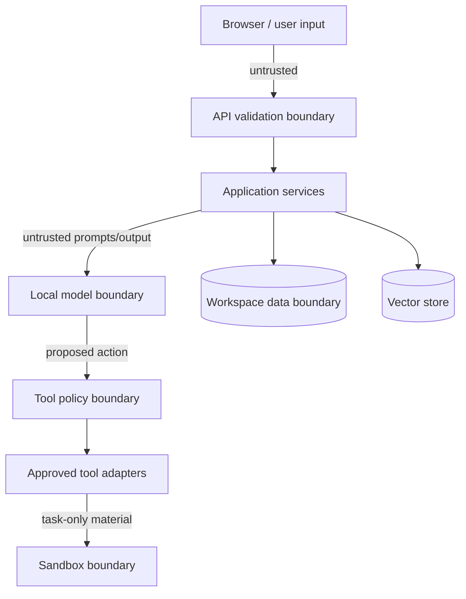

# Security and Sovereignty

## Security objectives

- Confidential inputs and generated outputs remain on the controlled host.
- Agent/model output cannot directly access host files, processes or networks.
- Only intended workspace resources are readable/writable.
- Every privileged or security-relevant decision is attributable and auditable.
- The product makes evidence-based sovereignty claims and exposes uncertainty.

## Trust boundaries

User files, prompts, model responses, extracted text and sandbox outputs are all untrusted. “Local” does not mean “safe.”

## Threat model

| Threat | Example | Required controls | Verification |
|---|---|---|---|
| Data egress | generated code calls external API | internal/no network, sandbox `none`, dependency-free runtime | egress negative test |
| Path traversal | `../../etc/passwd`, symlink escape | opaque IDs, canonical containment, reject symlinks | unit/integration cases |
| Prompt injection | PDF says to run shell or reveal other docs | content treated as evidence, server tool allowlist, workspace filters | adversarial document test |
| Command injection | filename/argument contains shell syntax | no shell strings, fixed argv, schema validation | malicious argument fixtures |
| Malicious file | oversized/decompression bomb/polyglot | size/page/pixel limits, MIME sniffing, parser timeouts | negative upload suite |
| Resource exhaustion | infinite loop/fork/output flood | CPU/memory/PID/time/output limits, one-run queue | sandbox limit tests |
| Cross-workspace access | guessed document UUID | ownership checks on every service/repository call | authorization integration test |
| Hallucinated evidence | invented SOP section | citation-ID allowlist, source mapping, abstention threshold | grounded QA evaluation |
| Audit leakage | logs contain prompt or document | structured metadata-only events, redaction tests | log scan |
| Artifact injection | formulas/links/macros in workbook | no macros, escape formula-leading user text, URL policy | artifact security test |
| Supply-chain/network drift | container fetches package/model at demo | pre-pulled images/models, locked deps, offline cold-start | offline rehearsal |

## Control baseline

### Application

- Allowlist MIME/extensions and verify content signatures where practical.
- Enforce configurable upload byte, PDF page, image pixel and extracted text limits.
- Store server-generated file names; sanitize display names.
- Parameterize SQL and use workspace-scoped repositories.
- Validate every model-produced action with strict Pydantic schemas.
- Maintain server-defined agent/tool permission matrices.
- Redact secrets and confidential content from logs and API errors.
- Add CSRF/origin protections if cookie authentication is introduced.

### Sandbox

- Ephemeral container, non-root UID, read-only root filesystem.
- `network_mode: none`; no Docker socket; no host PID namespace.
- Drop all Linux capabilities and apply `no-new-privileges`.
- Task-specific writable tmpfs/mount only; never mount application data root.
- CPU, memory, PID, disk/output and wall-clock limits.
- Fixed executable allowlist and argument arrays.
- Destroy runner after execution; persist only explicitly validated outputs.

### Local deployment

- Bind services to localhost or private Compose networks; do not publish PostgreSQL/Qdrant/Ollama publicly.
- Keep model/data volumes local and access-controlled.
- Use secret files/environment injection; commit only `.env.example`.
- Pin dependency/image versions and record hashes where feasible.
- Preload dependencies and models before offline operation.

## Sovereignty evidence model

The sovereignty screen reports three separate classes:

1. **Enforced configuration**: runtime network is internal, sandbox network is none, cloud provider adapters are absent/disabled.
2. **Observed evidence**: controlled egress-test result, local model request count, latest timestamps, audit counts.
3. **Health/unknowns**: unavailable probe or missing telemetry is explicitly `unknown`/`degraded`, never displayed as zero.

The application cannot prove the entire host has no traffic without host-level telemetry. Its claim is limited to the defined application, inference and sandbox boundaries.

## Controlled egress proof

- Invoke a purpose-built probe inside the same restricted runtime class.
- Attempt DNS resolution and TCP connection to a fixed documentation-domain endpoint with a short timeout.
- Expected result is network unreachable/denied; record timestamp, environment, exit reason and probe version.
- A failed test means sovereignty status is `failed` or `unknown`; never reinterpret it as success.
- Do not require public reachability to validate success: verify network namespace/configuration as primary evidence and connection denial as supporting evidence.

## Data lifecycle

Uploads are checksummed and immutable. Intermediate extracts remain workspace-bound. Sandbox copies are destroyed after runs. Artifacts are immutable revisions. Deletion is out of the initial build unless explicitly implemented with user confirmation, audit event and vector/file/metadata consistency checks.

## Production gaps

The prototype is not a compliance certification. Production requires identity and RBAC, encryption/key management, malware scanning, vulnerability management, signed images/SBOM, backup/restore testing, retention/legal hold, hardened sandbox profiles, security monitoring, incident response and independent penetration testing.
