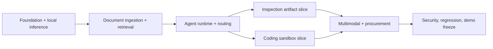

# Delivery Plan and Work Breakdown

## Delivery strategy

Build vertical slices in risk order. Each day ends with a runnable integration, test evidence and a scope check. Owners below are roles to assign, not assumed staffing.

## Critical path

## Seven-day plan

### Day 1: foundation

Goal: browser -> API -> local model works; database and UI shell are healthy.

- Scaffold monorepo, configuration, Compose networks/volumes and health checks.
- Add FastAPI/Next.js baseline, PostgreSQL migration framework and structured logging.
- Implement provider protocol and Ollama health/chat adapter.
- Seed model registry and basic Dashboard/Workbench/Models navigation.
- Add CI/local check commands and architecture/API skeleton.

Exit: clean startup, local response, persisted model metadata, no cloud SDK/dependency.

### Day 2: documents and knowledge

- Safe upload/storage, PDF extraction, OCR fallback and normalized pages.
- Chunking, local embeddings, Qdrant staging/activation and cited retrieval.
- Knowledge-base screen with actual statuses/errors.
- Unit and ingestion/retrieval integration tests.

Exit: selected SOP uploads, indexes, answers a fixed question with correct page/section.

### Day 3: routing and agent runtime — completed 2026-09-13

- Task contracts/state machine, worker and SSE/poll trace.
- Deterministic classifier/capability router with fixtures.
- Agent loop, strict action schemas, registry/policy gateway.
- `read_file`, `search_knowledge`, `create_docx`; inspection vertical slice.
- Hybrid Workbench evidence: direct reads for small files, temporary task-scoped RAG for large/multiple files, multi-knowledge-base retrieval, global ranking and source traceability.

Exit: one prompt routes, retrieves, generates and validates an approval DOCX automatically.

### Day 4: coding sandbox — completed 2026-09-13

- Coding profile/model route, repository read and patch proposal tools.
- Hardened ephemeral runner, fixed commands, limits, output capture and cleanup.
- Retry/observation loop and verification completion validator.
- Network, path, timeout and resource negative tests.

Exit: known defect is patched in working copy and all fixed tests pass with evidence.

### Day 5: multimodal and procurement — completed 2026-09-14

- Image/scanned-page processing and normalized evidence merge.
- Procurement extraction schema, policy comparison, XLSX and DOCX templates.
- Artifact publication/validation and download.
- Stabilize all three workflows using versioned demo data.

Exit: all three workflows complete without manual database/file edits.

### Day 6: security, observability and UX

- Sovereignty evidence/probe, audit query/UI and permission-denial display.
- Model/runtime health and measured metrics with honest unknown states.
- Loading/empty/error/cancel/retry states, accessibility pass and UI polish.
- Run full test/evaluation suite; fix flaky or unsafe behavior. Freeze features.

Exit: required security suite passes; workflow and sovereignty evidence is inspectable.

### Day 7: release and presentation

- Fresh-machine-equivalent build, cold start, restart and offline verification.
- Run all demos 10 times, capture evaluation report and known limitations.
- Prepare architecture visual, screenshots, 3-minute demo and backup recording.
- Tag release candidate only after final checklist.

Exit: repeatable offline demo, backup path and signed-off release checklist.

## Backlog by epic

Use IDs as issue prefixes.

| Epic | Tasks | Depends on |
|---|---|---|
| E1 Platform | E1.1 repo/tooling; E1.2 config; E1.3 Compose; E1.4 migrations; E1.5 health/logging | none |
| E2 Models | E2.1 provider protocol; E2.2 Ollama; E2.3 registry; E2.4 health; E2.5 router/tests | E1 |
| E3 Files/Documents | E3.1 storage; E3.2 validation; E3.3 PDF; E3.4 OCR/image; E3.5 normalized model | E1 |
| E4 Knowledge | E4.1 chunker; E4.2 embedding; E4.3 Qdrant; E4.4 citations; E4.5 activation | E2, E3 |
| E5 Agent | E5.1 states; E5.2 worker; E5.3 action schema; E5.4 runtime; E5.5 progress/cancel | E1, E2 |
| E6 Tools/Artifacts | E6.1 registry/policy; E6.2 file/RAG tools; E6.3 DOCX; E6.4 XLSX; E6.5 validation | E3-E5 |
| E7 Sandbox | E7.1 image; E7.2 controller; E7.3 limits; E7.4 patch/test; E7.5 negative tests | E5, E6 |
| E8 UI | E8.1 shell; E8.2 workbench; E8.3 models/KB; E8.4 trace; E8.5 sovereignty; E8.6 polish | APIs incrementally |
| E9 Quality/Demo | E9.1 fixtures; E9.2 evaluation; E9.3 offline test; E9.4 rehearsals; E9.5 backup | all |

## Task definition of ready

Requirement ID, user-visible outcome, acceptance test, dependencies, data/security impact and estimated size are known. Unclear tasks are split before implementation.

## Task definition of done

Implementation reviewed; relevant automated tests pass; error/empty states handled; audit/metrics added where applicable; docs/contracts updated; no secret/cloud dependency introduced; acceptance evidence linked.

## Scope control

If behind schedule, cut in order: React Flow, advanced dashboard charts, model fallback UI, mixed-layout enhancement, PPTX. Never cut workspace/path controls, tool permissions, sandbox isolation, evidence validation, audit trace, offline proof, or any of the three complete demo outcomes.
