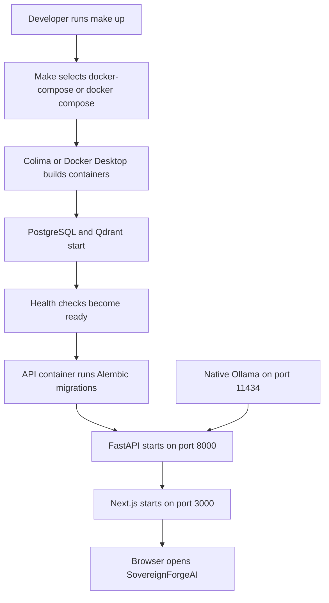
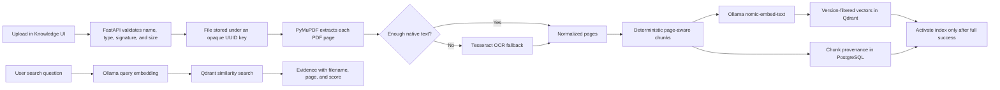

# Setup and Run Guide

This is the operator runbook for starting SovereignForgeAI on the current Mac and after moving the repository to another machine.

## Quick command map

| Situation | Commands |
|---|---|
| First setup on a machine | `make doctor`, `make setup`, `make ollama-models`, `make up` |
| Normal daily start | start Docker and Ollama, then `make up` |
| Check the stack | `make status` and `curl http://localhost:8000/api/v1/readiness` |
| View logs | `make logs` |
| Run quality checks | `make check` and `npm run build` |
| Restart containers | `make restart` |
| Stop application containers | `make down` |

## Services and ports

| Service | Location | Address |
|---|---|---|
| Next.js frontend | Docker | <http://localhost:3000> |
| FastAPI and OpenAPI | Docker | <http://localhost:8000/docs> |
| Ollama | Native host process | `http://localhost:11434` |
| PostgreSQL | Private Docker network | not published to host |
| Qdrant | Private Docker network | not published to host |
| Sandbox controller | Private internal Docker network | not published to host |
| Generated-code containers | Ephemeral Docker runtime | no network or host port |

Ollama runs natively on Apple Silicon so it can use Metal. PostgreSQL, Qdrant, the API, and frontend run in Docker. The M1 8 GB configuration intentionally permits one loaded model and one concurrent model request.

## First-time setup on a new macOS machine

### 1. Copy or clone the source

Using Git is recommended because ignored build output and machine-local data will not be copied:

```bash
git clone <repository-url> ai-agentic-flow
cd ai-agentic-flow
```

If copying the folder manually, do not copy `node_modules`, `frontend/.next`, `backend/.venv`, `.docker-local`, or `.env`. Docker volumes and downloaded Ollama models are machine-local and are not contained in the repository.

### 2. Install system prerequisites

Install Homebrew if the destination Mac does not already have it. Then install the development tools:

```bash
brew install node@22 uv ollama colima docker docker-compose docker-buildx
brew link --overwrite --force node@22
```

Node.js 22.13 or newer is recommended. Confirm the tools are visible:

```bash
node --version
npm --version
uv --version
ollama --version
docker --version
docker-compose version
```

Docker Desktop can be used instead of Colima. When using Docker Desktop, start the application and wait until its engine reports that it is ready. The Makefile automatically uses standalone `docker-compose` when available and otherwise tries `docker compose`.

### 3. Start the container engine

For the tested M1 8 GB Colima profile:

```bash
colima start --cpu 2 --memory 4 --disk 30
```

This reserves 4 GB for containers and leaves the remaining memory for macOS and native Ollama. Do not run both Docker Desktop and Colima at the same time for this prototype.

### 4. Validate and install repository dependencies

From the repository root:

```bash
make doctor
make setup
```

`make setup` creates `.env` from `.env.example` only when `.env` does not exist, installs locked npm packages, and creates the backend's `uv` environment. Review `.env` after creation if ports, database credentials, limits, or model names need to differ on the new machine.

Do not commit `.env`. It is machine-local configuration.

### 5. Start Ollama and download models

In terminal 1, start the restricted local Ollama process:

```bash
make ollama-serve
```

Leave this terminal running. If the Ollama macOS application already owns port `11434`, do not start a second server; confirm it is available with `curl http://localhost:11434/api/tags`.

In terminal 2, download the four prototype models once:

```bash
make ollama-models
```

This installs:

- `qwen3:1.7b` for general reasoning
- `qwen2.5-coder:1.5b` for coding
- `nomic-embed-text` for document embeddings
- `gemma3:4b` for local image and scanned-page analysis

Model downloads are not repeated during normal application startup.

### 6. Build and start SovereignForgeAI

Still in terminal 2:

```bash
make up
make status
curl http://localhost:8000/api/v1/readiness
```

`make up` builds the ARM64-compatible containers, including the Day 4 sandbox runtime, starts PostgreSQL and Qdrant, applies all Alembic migrations automatically, and starts the API and frontend. A successful readiness response reports PostgreSQL, Qdrant, and Ollama as `ready`.

Open:

- Application: <http://localhost:3000>
- Knowledge workflow: <http://localhost:3000/knowledge>
- Agent Workbench: <http://localhost:3000/workbench>
- Persistent execution trace: <http://localhost:3000/trace>
- API documentation: <http://localhost:8000/docs>

### 7. Verify the installed system

```bash
make check
npm run build
```

For the grounded-knowledge smoke test, upload `demo-data/pump-maintenance-sop.md` from the Knowledge screen and search for:

```text
How do I safely isolate pump P-101 before maintenance?
```

The result should cite `pump-maintenance-sop.md`, page 1.

For the Day 3 governed-agent smoke test, open the Workbench, enter an approval outcome, and select **Run sovereign agent**. The UI should progress through durable classification, routing, evidence/model, artifact, and completion steps. A successful run shows `VERIFIED LOCAL`, a downloadable validated DOCX, and a corresponding entry in the Trace screen.

For the Day 4 coding smoke test, upload `demo/day4-coding/day4-broken-repository.zip` in Workbench, select **Coding agent** and `pytest -q`, and ask the agent to fix the `add` defect with the smallest safe change. The baseline must fail, the no-network probe must pass, the patched tests must pass, and the result must provide a patch, verified repository ZIP, and sandbox JSON report.

For the Day 5 procurement smoke test, upload
`demo/day5-procurement/quotations-v1.csv` and
`demo/day5-procurement/procurement-policy-v1.md` together, select
**Procurement agent**, and run the prefilled request. The result must recommend
Aravind Industrial subject to human approval, flag Beacon Controls, and publish
validated XLSX and DOCX downloads.

## Normal startup on the second and later days

Dependencies, images, volumes, migrations, and models do not need to be reinstalled every day.

### Terminal 1: container engine and Ollama

```bash
colima start
make ollama-serve
```

Skip `colima start` if the engine is already running. Skip `make ollama-serve` when Ollama is already serving on port `11434`.

### Terminal 2: application

```bash
cd <path-to>/ai-agentic-flow
make up
make status
```

Then open <http://localhost:3000>. `make up` is safe for repeated use: it preserves named PostgreSQL, Qdrant, and uploaded-file volumes and applies only pending migrations.

You only need to run `make setup` again after `package-lock.json`, `backend/pyproject.toml`, or `backend/uv.lock` changes. You only need `make ollama-models` again when model names change or the local Ollama model store was removed.

## Stopping the project

Stop application containers while preserving all named-volume data:

```bash
make down
```

Stop the Ollama process with `Control-C` in its terminal. Optionally stop Colima to release its reserved memory:

```bash
colima stop
```

`make down` does not delete database, vector, or uploaded-file volumes. Do not add the Compose `-v` option unless permanent data deletion is explicitly intended.

## After pulling new code

```bash
git pull
make setup
make up
make check
```

The API container applies pending database migrations during startup. Existing named-volume data remains in place.

## Moving existing data to another machine

Copying the Git repository transfers source code and demo files only. It does not transfer:

- PostgreSQL records
- Qdrant vectors
- uploaded documents in the Docker volume
- downloaded Ollama models
- `.env` configuration

For a clean prototype installation, repeat the first-time setup and re-upload the source documents. If existing application state must be preserved, create explicit PostgreSQL, Qdrant, and upload-volume backups before moving; a tested backup/restore command is not part of the Day 2 prototype yet.

## Troubleshooting

### Docker is unavailable

```bash
colima status
colima start --cpu 2 --memory 4 --disk 30
make status
```

With Docker Desktop, start Docker Desktop and wait for the engine. If only the Compose plugin is installed, run Make with:

```bash
make COMPOSE="docker compose" up
```

### Ollama is unavailable

```bash
curl http://localhost:11434/api/tags
make ollama-serve
```

If port `11434` is already occupied, an Ollama server is probably already running. Use the existing server.

### A model is missing

```bash
make ollama-models
ollama list
```

### A service fails to start

```bash
make status
make logs
```

Use `Control-C` to stop following logs. The most common causes are unavailable ports `3000`, `8000`, or `11434`, an inactive container engine, or an Ollama model that has not been downloaded.

### Apple Silicon memory pressure

- Keep the Colima VM at 4 GB for this prototype.
- Do not run multiple Ollama servers.
- Keep `MAX_CONCURRENT_MODEL_REQUESTS=1`.
- Close unused model-heavy applications during ingestion or generation.
- Stop Colima after work with `colima stop`.

## Repository and toolchain: how everything works from top to bottom

### What this repository contains

This repository is the complete SovereignForgeAI prototype source of truth. It contains the web interface, API, database migrations, local-AI integration, document-processing pipeline, container definitions, automated tests, deterministic demo data, and engineering documentation. Generated dependencies and runtime data are deliberately excluded from Git so each machine can build a clean, reproducible environment.

```text
ai-agentic-flow/
├── frontend/          Next.js web application and browser-facing workflows
├── backend/           FastAPI API, domain services, migrations, and tests
├── sandbox-image/     non-root, no-network generated-code runtime image
├── sandbox-runner/    internal Docker controller and hard resource policies
├── demo/              versioned workflow fixtures, including the broken Day 4 repository
├── demo-data/         safe, deterministic files for demonstrations
├── docs/              architecture, requirements, plans, and runbooks
├── docker-compose.yml local application and data-service orchestration
├── Makefile           human-friendly setup, start, stop, and check commands
├── package.json       npm workspaces and Turborepo entry point
└── .env.example       documented configuration defaults
```

The repository itself does not contain passwords, downloaded models, database contents, vector data, uploaded documents, `node_modules`, Python virtual environments, or build output.

### What each tool does

| Tool | Responsibility |
|---|---|
| Git | Transfers and versions the source code and documentation |
| Make | Provides short, consistent operator commands such as `make setup` and `make up` |
| Node.js and npm workspaces | Install and run JavaScript tooling for the root workspace and frontend |
| Turborepo | Runs frontend and backend lint, type-check, test, and build tasks together with caching |
| uv | Locks Python packages and creates the backend virtual environment |
| Next.js and TypeScript | Render the local browser UI and call the API through typed client code |
| FastAPI and Pydantic | Expose validated HTTP contracts and coordinate application services |
| SQLAlchemy and Alembic | Persist relational metadata and apply ordered database schema migrations |
| PostgreSQL | Store workspaces, models, files, documents, chunks, knowledge bases, and ingestion jobs |
| PyMuPDF | Extract native text page by page from PDF documents |
| Tesseract OCR | Recover text from scanned PDF pages and uploaded images |
| Ollama | Run local language and embedding models without a cloud AI provider |
| Qdrant | Store embedding vectors and perform filtered semantic similarity search |
| Docker Compose | Connect and supervise the frontend, API, data services, and isolated sandbox controller |
| Colima or Docker Desktop | Provide the local Linux container engine on macOS |
| Ruff, mypy, ESLint, TypeScript, Pytest, and Vitest | Enforce code quality and catch regressions |
| Playwright | Verify the real browser interface and frontend-to-API behavior |

### Startup flow



`make up` is the top-level entry point, but it does not start Ollama or the macOS container engine. Those are host-level services and must already be running. Compose waits for PostgreSQL and Qdrant health checks before starting the API. The API applies pending migrations before accepting requests, and the frontend starts after the API container is launched.

### Normal browser request flow

1. The user opens `http://localhost:3000`.
2. Next.js renders the interface from `frontend/`.
3. The browser calls `http://localhost:8000/api/v1/...`.
4. FastAPI validates the request with Pydantic schemas.
5. A route delegates work to a backend service instead of directly containing business logic.
6. SQLAlchemy reads or writes metadata in PostgreSQL.
7. The API returns structured JSON; the frontend renders success, progress, or error state.

### Document ingestion and search flow



Uploaded filenames never become filesystem paths. The backend creates an opaque storage key and keeps provenance in PostgreSQL. Native PDF extraction is attempted first; OCR is used only for pages with insufficient text to control memory and latency. Chunks are embedded locally in small batches for the M1 8 GB profile.

Qdrant stores vectors and searchable payloads, while PostgreSQL remains authoritative for document and ingestion state. Every index is versioned. A replacement version becomes active only after the entire ingestion succeeds, so a failed re-index cannot replace the last usable index.

For search, the question is embedded by the same local embedding model. Qdrant searches only the selected knowledge-base ID and active index version. The API returns the matching text together with its document ID, display filename, page range, and similarity score.

### Local AI request flow

The FastAPI application never calls a cloud model provider. It communicates with native Ollama through `host.docker.internal:11434`. Ollama runs the configured model on the Mac and uses Metal acceleration on Apple Silicon. The provider adapter keeps Ollama-specific HTTP contracts behind a backend interface so another local runtime can be added later without rewriting the domain workflows.

The 8 GB safety profile uses:

- one concurrent model request;
- one loaded Ollama model at a time;
- lightweight quantized language models;
- embedding batches of eight chunks;
- page-at-a-time OCR;
- bounded vector upserts.

### Persistence and rebuild behavior

Docker Compose creates three named volumes:

| Volume | Contents |
|---|---|
| `postgres_data` | relational application state and migration history |
| `qdrant_data` | document embedding vectors and Qdrant collection state |
| `workspace_data` | uploaded files and normalized extracted pages |

`make down`, `make up`, container rebuilds, and source-code updates preserve these volumes. Ollama models are stored separately by Ollama on the host. A fresh machine therefore receives none of this runtime state from Git and must download models and either re-ingest documents or restore separately created backups.

### Development and verification flow

```text
source change
    ↓
make check
    ↓
Turborepo runs lint + type-check + tests for both workspaces
    ↓
npm run build
    ↓
production frontend build + backend bytecode compilation
    ↓
make up
    ↓
container build + migrations + local integration verification
```

Use `make check` before considering a change complete. Turborepo coordinates the JavaScript and Python workspace commands and reuses cached results when inputs have not changed. Use `npm run build` to catch production-only frontend or packaging failures. Use `make up` afterward when a change affects containers, migrations, dependencies, environment variables, or integration behavior.

### Where to make common changes

| Desired change | Primary location |
|---|---|
| Page, component, or styling | `frontend/app/` or `frontend/components/` |
| Browser API client or TypeScript contract | `frontend/lib/` |
| HTTP endpoint | `backend/app/api/routes/` |
| Request or response validation | `backend/app/schemas/` |
| Business workflow | `backend/app/services/` |
| PDF extraction or chunking | `backend/app/documents/` |
| Local model integration | `backend/app/model_providers/` |
| Relational model | `backend/app/db/models.py` plus a new Alembic migration |
| Container or network behavior | `docker-compose.yml` or a service Dockerfile |
| Configuration default | `.env.example` and the typed backend settings |
| Architecture or operating decision | the corresponding file under `docs/` |

The intended dependency direction is browser UI → API route → validated service/domain logic → provider or persistence adapter. Keep database, Ollama, Qdrant, OCR, and filesystem details behind their backend boundaries instead of coupling them directly to frontend code.

### Current prototype boundary

The repository currently contains the Day 1 foundation and Day 2 grounded-knowledge vertical slice. It is a working prototype, not yet the final production architecture. Durable worker recovery, governed multi-step agent execution, sandboxed tools, artifact generation, full audit coverage, and enforced runtime egress controls belong to later delivery days. The build records under `docs/` describe exactly what is implemented and verified at each milestone.
