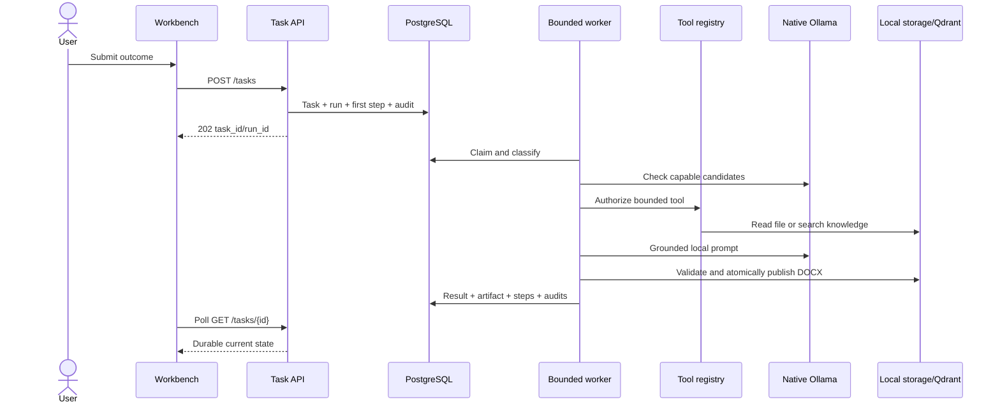

# Day 3 Build Record

Date: 2026-09-13  
Hardware: MacBook Air, Apple M1, 8 GB unified memory  
Status: completed and locally verified

## Outcome

Day 3 delivers the first complete governed-agent vertical slice. An authenticated user can submit a workspace task, observe durable progress, inspect deterministic routing evidence, receive a local model result, download a validated DOCX artifact, and inspect/export the persistent audit trail. All task data and referenced resources are restricted to the user's organization.

## Implemented

- Organization ownership on workspaces and tenant checks for workspace, file, knowledge-base, ingestion, task, run, artifact, and audit access.
- Compatibility backfill `20260913_0005` creates a default workspace for every pre-Day-3 organization that does not already own one.
- Durable `tasks`, `task_runs`, `task_steps`, `artifacts`, and `audit_events` tables through additive migration `20260913_0004`.
- Idempotent task submission using `Idempotency-Key` plus a canonical request hash.
- Deterministic task classification into general, document, RAG, spreadsheet/procurement, or coding work.
- Capability-first model routing that records every candidate, missing capabilities, health, latency, priority, and selection reason.
- Bounded local worker with one active model workload, maximum steps, retries, tool timeouts, task deadline, cancellation, retry, and startup recovery.
- Strict governed-tool registry for workspace file reads, knowledge search, and DOCX publication.
- On-demand local PDF/image extraction in `read_file`, allowing a newly uploaded Workbench file to be used without first building a vector index.
- Bounded hybrid Workbench retrieval: one small file is read directly; large or multiple files are chunked and semantically ranked with temporary in-memory embeddings; every selected ready knowledge base is searched; all evidence is merged and globally bounded.
- Source-level provenance for processed files, searched knowledge bases, selected passages, page ranges, retrieval modes, and evidence budgets in task steps and audit events.
- Grounded knowledge flow with source IDs, document/page citations, and explicit insufficient-evidence behavior.
- Atomic DOCX publication with required-section validation, SHA-256 digest, immutable artifact metadata, and human-approval notice.
- Live Workbench polling, cancellation, task classification/model display, persisted execution steps, result text, and artifact download.
- Persistent Trace screen with run selection, timings, profile, retries, routing decision, steps, failures, and local JSON export.

## Runtime flow



## State and safety rules

```text
queued -> running -> completed
                  -> failed -> retry creates a new attempt
                  -> cancelled
                  -> timed_out

active task -> cancel_requested -> cancelled at the next safe boundary
```

- PostgreSQL is authoritative; the UI never synthesizes completed state.
- A retry creates a new `task_run`; previous attempts remain available for audit.
- Recovery requeues incomplete runs after API restart.
- Tool inputs are strict Pydantic schemas and unknown fields are rejected.
- The server resolves file/artifact paths and validates workspace ownership; the model never supplies paths.
- Raw internal exceptions are not returned to users or persisted as public error messages.
- The current prototype serializes execution in-process to fit the M1 8 GB resource envelope.

## API surface

| Method and path | Purpose |
|---|---|
| `POST /api/v1/tasks` | Validate, idempotently create, and queue a task |
| `GET /api/v1/tasks` | List organization-scoped tasks and latest runs |
| `GET /api/v1/tasks/{id}` | Poll task, steps, citations, result, and artifacts |
| `POST /api/v1/tasks/{id}/cancel` | Request cancellation at a safe boundary |
| `POST /api/v1/tasks/{id}/retry` | Create a new bounded attempt after unsuccessful termination |
| `GET /api/v1/runs/{id}/steps` | Read ordered durable execution steps |
| `GET /api/v1/runs/{id}/artifacts` | Read artifact metadata |
| `GET /api/v1/artifacts/{id}/content` | Download an organization-scoped artifact |
| `GET /api/v1/audit-events` | Read organization/run-scoped audit events |

## Verification evidence

- `npm run check`: all six Turborepo tasks succeeded.
- Backend: Ruff and strict mypy passed; 15 tests passed after hybrid-retrieval and control-stabilization regression coverage.
- Added coverage for deterministic routing, durable/idempotent creation, cross-tenant denial, policy denial, direct PDF extraction, and DOCX section validation.
- Frontend: ESLint, TypeScript, and Vitest passed; Next.js production build generated all 12 routes.
- Compose rebuilt successfully; migration `20260913_0004` was applied automatically; PostgreSQL, Qdrant, and Ollama all reported ready.
- Real run `b6fdb65c-79c4-411c-8420-03ba9ffea1c7` selected `qwen3:1.7b`, completed six durable steps in 11.5 seconds with zero retries, and published a 37 KB validated DOCX.
- The downloaded DOCX passed full ZIP-package integrity validation and its audit trail contained task creation, classification, model selection, tool authorization, artifact publication, and completion.
- Playwright authenticated to the running app, observed organization isolation, executed another task from the Workbench, rendered six live steps and `VERIFIED LOCAL`, displayed the validated DOCX, and loaded the corresponding persistent Trace screen.
- Playwright exposed and drove the correction of a duplicated API-prefix artifact URL before final verification.
- The 14-item UI/control stabilization pass is recorded in [`21-day-3-ui-stabilization.md`](21-day-3-ui-stabilization.md).
- Rendered trace evidence is retained at `../day3-trace.png`.

## Key implementation locations

- Migration: `backend/alembic/versions/20260913_0004_day3_agent_runtime.py`
- Models: `backend/app/db/models.py`
- Task contract/API: `backend/app/schemas/tasks.py`, `backend/app/api/routes/tasks.py`
- State and persistence: `backend/app/tasks/service.py`
- Agent runtime: `backend/app/tasks/runtime.py`
- Classifier/router: `backend/app/routing/router.py`
- Governed tools: `backend/app/tools/registry.py`
- DOCX publisher: `backend/app/artifacts/docx.py`
- Live UI: `frontend/components/control-plane/workbench.tsx`, `trace-security.tsx`
- Tests: `backend/tests/test_tasks.py`

## Known limits carried forward

- Worker coordination is a serialized in-process lock suitable for the prototype, not a distributed queue.
- Cancellation is cooperative between governed steps; it cannot interrupt an Ollama response already in flight.
- The worker uses deterministic orchestration rather than model-selected arbitrary tool calls. This is intentional for auditability and demo reliability.
- DOCX is the first output renderer; spreadsheet and code-patch artifact renderers remain later milestones.
- Historical attempts are retained in PostgreSQL, while the current task detail response embeds the latest attempt.
- Audit export is client-generated JSON from authenticated task/audit APIs; signed audit bundles are not yet implemented.

## Day 4 entry criteria

The governed runtime boundary is proven. Day 4 can add the isolated coding workflow: repository reads, patch proposals, hardened execution, fixed verification commands, and completion validation using the same task/run/tool/artifact contracts.
