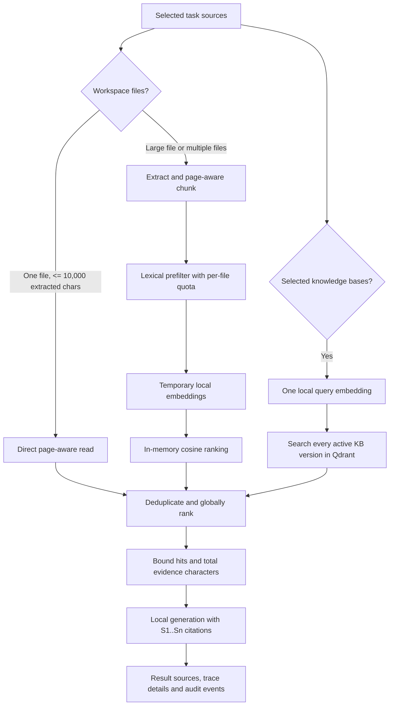

# Day 3 Hybrid Workbench Retrieval

Date: 2026-09-13  
Hardware target: MacBook Air, Apple M1, 8 GB unified memory  
Status: implemented and locally verified

## Outcome

A Workbench task now processes every selected workspace file and every selected ready knowledge base. Users can ask questions about newly uploaded documents without manually indexing them in Knowledge first, while reusable collections continue to use their persistent Qdrant indexes.

## Decision flow

Temporary Workbench vectors live only in process memory for the retrieval step. They are never written to Qdrant, so there is no temporary vector collection to clean up. Normalized extraction is retained under the workspace for repeatability and audit provenance.

## M1/8 GB safety defaults

| Setting | Default | Purpose |
|---|---:|---|
| `TASK_DIRECT_READ_CHARS` | 10,000 | Maximum extracted size for the one-file direct path |
| `TASK_EPHEMERAL_MAX_CHUNKS` | 128 | Maximum temporary chunks embedded per task |
| `TASK_EMBEDDING_BATCH_SIZE` | 8 | Bounds embedding-model memory pressure |
| `TASK_KB_HITS_PER_BASE` | 5 | Candidate passages requested from each selected KB |
| `TASK_EVIDENCE_MAX_HITS` | 10 | Maximum passages supplied to generation |
| `TASK_EVIDENCE_MAX_CHARS` | 24,000 | Combined evidence text budget |
| `TASK_EVIDENCE_TIMEOUT_SECONDS` | 120 | Independent bounded retrieval deadline |

The temporary candidate budget is divided across selected files before global ranking so one large document cannot consume every embedding slot. Final evidence permits at most three passages per document to improve source diversity.

## Provenance contract

The persisted `Hybrid evidence gathered` task step contains:

- retrieval mode: `direct_read`, `temporary_rag`, `knowledge_base_rag`, or `hybrid`;
- every processed file with ID, display name, page count, chunk count, mode and selected-hit count;
- every searched knowledge base with ID, name, active version, result count and selected-hit count;
- every passage used for generation with source ID, document, page range and retrieval origin;
- total candidate chunks and final evidence-character count.

Audit events record `FILE_ACCESSED` once for each processed file, `RAG_SEARCHED` once for each selected knowledge base, and `EVIDENCE_MERGED` for the bounded final set. Raw document text and embeddings are not written into audit payloads.

## Verification

- Ruff passed.
- Strict mypy passed for all application modules.
- 15 backend tests passed.
- Tests prove multiple selected files use bounded temporary RAG and that a direct file plus every selected knowledge base are merged with sequential source IDs.
- Frontend TypeScript, ESLint and the production build passed.
- Workbench displays the citations used for generation; Trace expands persisted source/page/retrieval-mode evidence.
- Playwright submitted real task `bfebf0d4-526e-4ca2-8278-492eb68f9d0f` with two newly uploaded Markdown documents. The local run considered 13 page-aware chunks, selected six passages across both files, supplied 14,207 bounded evidence characters to `qwen3:1.7b`, produced a cited result and validated DOCX, and persisted one `FILE_ACCESSED` event per file plus `EVIDENCE_MERGED`.
- The two browser-test uploads were removed after verification; their task and audit provenance remain intentionally retained.

## Remaining boundary

This is task-scoped retrieval, not durable knowledge ingestion. Files that should be reused, curated, versioned and searched repeatedly still belong in a Knowledge Base. Day 4 remains the hardened coding-sandbox milestone.
