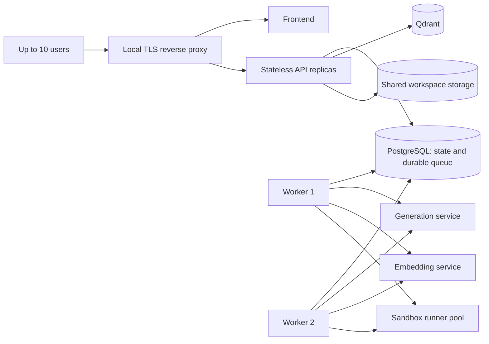

# Scaling and Capacity Plan

Status: proposed production evolution; capacity is not yet benchmark-certified  
Baseline: one Apple Silicon M1 with 8 GB unified memory, native Ollama, and Docker-hosted application services  
Target: reliable service for 10 authenticated users while preserving the local-only data boundary

## Purpose

This document explains what the current prototype can process concurrently, how latency and throughput should be measured, and how to evolve the deployment for 10 users. It separates measured facts from targets. A hardware or software configuration is not a capacity claim until the load test in this document passes.

## Terms and measurements

| Term | Meaning | Required measurement |
|---|---|---|
| Active user | A signed-in user browsing, uploading, searching, or running a task | Concurrent sessions and requests by route |
| Concurrent request | A request that overlaps another request in wall-clock time | In-flight API requests |
| Concurrent model request | A generation or embedding operation executing at the same time as another | Model-server running and queued requests |
| Throughput | Completed work per unit of time | Requests/second, runs/minute, input tokens/second, output tokens/second |
| API latency | Time from HTTP request to HTTP response | p50, p95, and p99 by route class |
| Queue latency | Time from task acceptance until execution starts | p50, p95, and maximum |
| Time to first token (TTFT) | Time from generation request until the first generated token is visible | p50 and p95, warm and cold |
| Inter-token latency (ITL/TPOT) | Time between generated tokens after the first token | p50 and p95 |
| End-to-end task latency | Time from task acceptance to a terminal state | p50, p95, and timeout rate |

Average latency alone is insufficient because it hides slow queued requests. Every capacity result must include percentiles, errors, cancellations, timeouts, queue depth, and peak memory.

## Current prototype capacity

### What can run concurrently

The current deployment has one `api-worker` process, started as one Uvicorn process. Lightweight API requests can overlap through FastAPI's async/thread-pool behavior, PostgreSQL, and Qdrant. This is suitable for several users browsing metadata, but it has not been load-tested and has no published requests-per-second guarantee.

Governed task execution is different. Submitted runs remain in PostgreSQL with `queued` status. A lifecycle worker polls the durable records in FIFO order, and all `execute_run` calls share one process-local `asyncio.Lock`, so exactly **one governed task run executes at a time per API process**.

The model profile also configures Ollama for one parallel request and one loaded model. This protects an 8 GB Mac from memory pressure, but it means the node is designed for serialization rather than model concurrency.

| Workload | Current behavior | Capacity statement |
|---|---|---|
| Sign-in, model/task lists, trace polling | Requests may overlap | Not benchmarked; no certified limit |
| File upload and metadata operations | May overlap within API and storage limits | Not benchmarked; large uploads can compete for memory and disk |
| Qdrant search | Requests may overlap, but every semantic query first needs an embedding | Model-side embedding contention can serialize or queue work |
| Knowledge ingestion | Background work may overlap other requests | Competes for the single Ollama runtime and should be admission-controlled |
| Governed agent runs | PostgreSQL-backed FIFO polling, serialized by a process-local lock | One active run; additional runs remain visibly queued |
| Direct inference | Application has no model semaphore around the route | Effective limit is delegated to Ollama; this is not a safe production admission policy |

`MAX_CONCURRENT_MODEL_REQUESTS=1` expresses the intended profile, but the current application does not consistently enforce it around every generation and embedding call. It must not be presented as an implemented cross-process concurrency controller.

Implementation evidence:

- [`runtime.py`](../backend/app/tasks/runtime.py) contains the process-local worker lock.
- [`tasks.py`](../backend/app/api/routes/tasks.py) commits work and signals the lifecycle worker without owning execution.
- [`inference.py`](../backend/app/api/routes/inference.py) calls the model provider without acquiring a shared application permit.
- [`config.py`](../backend/app/core/config.py) defines the intended concurrency setting.
- [`docker-compose.yml`](../docker-compose.yml) starts the combined API/worker as a single Uvicorn process.

### What happens if 10 users submit together

The API can accept 10 task submissions and create durable task/run records, but the work is not processed ten at a time. One run executes and the other nine remain queued in PostgreSQL.

For one serialized worker and average execution time `S` seconds:

```text
maximum steady-state throughput = 60 / S runs per minute
last start time in a burst of 10 = 9 × S seconds
average queue wait in that burst = 4.5 × S seconds
```

Example only: if a representative task occupies the worker for 30 seconds, the theoretical maximum is 2 runs/minute, average wait for a burst of 10 is 135 seconds, and the tenth run cannot start until about 270 seconds. These are queueing calculations, not measured product results.

The worker resets the execution deadline when a run starts, so time spent in the queue no longer consumes the run's execution budget. A separate maximum queue age and overload limit are still required before certifying a ten-user production capacity.

### Honest current answer

- Ten users can plausibly remain signed in and browse, but this must still be verified by a load test.
- Ten users may submit work, but governed runs execute one at a time and queue latency increases with every run ahead of them.
- The certified number of concurrent model requests is currently **not measured**.
- The deliberate safe operating point for the M1/8 GB demo is **one active governed model workload**.

## Ten-user service definition

"Support 10 users" must be converted into a workload rather than interpreted as 10 models generating continuously. Use this initial planning profile and revise it from observed usage:

| Dimension | Initial target |
|---|---|
| Authenticated sessions | 10 simultaneous sessions |
| Browsing/polling traffic | 10 virtual users; up to 10 aggregate API requests/second during a short burst |
| Simultaneous task submissions | Burst of 10 accepted without duplicates or lost work |
| Simultaneous model-heavy work | 2 initially; scale to 4 only after memory and latency tests pass |
| Queue behavior | Durable, visible, cancellable, fair, and recoverable after restart |
| Normal-load queue delay | p95 at or below 30 seconds |
| Metadata API latency | p95 at or below 300 ms on the local network |
| Task acceptance latency | p95 at or below 500 ms; execution remains asynchronous |
| Warm TTFT | Proposed p95 at or below 3 seconds for the selected model and bounded prompt profile |
| Task completion | Proposed p95 at or below 120 seconds for the agreed evaluation dataset |
| Reliability | At least 99% accepted tasks reach an expected terminal state; zero lost or double-executed runs |

These are proposed service objectives, not current achievements. Model size, prompt length, output length, retrieval volume, and artifact type must be fixed in the benchmark definition.

## Scaling design for 10 users



### 1. Separate API request handling from task execution

The first step is implemented: `execute_run` no longer uses FastAPI `BackgroundTasks`; task submission commits the run, signals a lifecycle worker, and returns `202`. The next production step is moving that lifecycle worker into a dedicated service.

Use a durable local queue. PostgreSQL is already authoritative and can support worker leasing with `SELECT ... FOR UPDATE SKIP LOCKED`, lease expiry, heartbeat, attempt count, and idempotent state transitions. Redis is optional, not required for a 10-user target.

Required properties:

- a committed job survives API and worker restarts;
- only one worker owns a run lease at a time;
- an expired lease can be safely reclaimed;
- cancellation is visible to the owning worker;
- retries do not publish duplicate artifacts;
- queue position and estimated wait are exposed to the UI;
- fairness prevents one user or organization from monopolizing workers.

Start with two worker processes. Do not increase the worker count above the proven model and sandbox capacity.

### 2. Add one shared model admission controller

Every generation and embedding path must acquire a shared capacity permit, including direct inference, task routing probes, retrieval, ingestion, and tools. A Python semaphore inside one process is insufficient after replicas are introduced.

The controller should enforce:

- separate generation and embedding limits;
- maximum queued work and bounded wait time;
- per-user or per-organization quotas;
- prompt-token and output-token limits;
- overload responses with an actionable retry delay;
- cancellation while queued;
- metrics for running, queued, rejected, and timed-out requests.

On the M1/8 GB machine, keep generation concurrency at one until a load test proves otherwise. Two application workers can improve resilience and overlap non-model steps even when only one may hold the model permit.

### 3. Separate generation from embeddings

Ingestion and search embeddings should not unexpectedly delay interactive generation. The preferred production shape is a distinct embedding service with its own small model and capacity budget.

On one 8 GB unified-memory machine this separation may still contend for the same hardware. For reliable 10-user service, place embeddings on another local node or use a larger-memory host. Existing vectors must be rebuilt if the embedding model changes.

### 4. Stream generated output

The current Ollama adapter requests a complete non-streaming response. Add server-sent events or an equivalent streaming transport so the user sees the first token without waiting for the complete answer. Streaming improves perceived latency and makes TTFT observable; it does not increase the underlying tokens/second.

Persist bounded checkpoints and the final validated result rather than treating a partially streamed answer as a completed task artifact.

### 5. Choose the model serving tier from measurements

For the current Mac, Ollama remains the low-complexity baseline. Tune keep-alive and model switching before adding parallel model execution.

vLLM's main advantages are continuous batching, paged KV-cache management, prefix caching, and an OpenAI-compatible serving API. On Apple Silicon this requires the vLLM-Metal plugin. It is most promising when several requests use the same warm model; it is not a guaranteed single-request latency improvement. vLLM also supports one model runner per server instance, so separate generation and embedding models normally require separate instances and memory budgets.

References:

- [vLLM-Metal project and Apple Silicon requirements](https://github.com/vllm-project/vllm-metal)
- [vLLM-Metal supported models and prefix-cache support](https://github.com/vllm-project/vllm-metal/blob/main/docs/supported_models.md)
- [vLLM OpenAI-compatible server](https://docs.vllm.ai/en/latest/serving/online_serving/openai_compatible_server/)
- [Ollama concurrency and model-loading behavior](https://docs.ollama.com/faq)

For a 10-user deployment, benchmark these candidates with the same model family, effective quantization, prompt tokens, output tokens, warm state, and concurrency:

1. current Ollama profile, concurrency 1;
2. Ollama with a safely increased queue/parallel configuration;
3. vLLM-Metal on the target Apple Silicon machine;
4. upstream vLLM on a dedicated supported Linux GPU host if production throughput justifies another node.

Do not compare different model sizes or quantizations and attribute the difference only to the server.

### 6. Scale stateless and stateful services independently

- Run two API replicas behind a local reverse proxy only after task execution is removed from process-local background work.
- Keep PostgreSQL authoritative; configure a bounded connection pool and inspect query plans before increasing connections.
- Keep one Qdrant node for the initial 10-user target unless measured vector latency or availability requirements require replication.
- Use shared, access-controlled artifact/upload storage when API and workers run on different nodes.
- Run a bounded sandbox pool separately from model workers. Never increase sandbox concurrency without CPU, memory, PID, disk, and timeout enforcement.
- Preserve internal-only networks, authenticated service calls, audit records, and the no-cloud-model boundary while scaling.

## Capacity and load-test plan

### Fixed test dataset

Record these inputs with every result:

- hardware model, CPU/GPU cores, unified/system memory, and free disk;
- macOS/Linux, model server, application commit, container images, and configuration;
- exact model identity, format, quantization, and context limit;
- prompt-token and requested output-token distributions;
- warm or cold model state;
- direct inference, retrieval, ingestion, coding sandbox, and artifact mix;
- number of API replicas, task workers, model permits, and sandbox slots.

### Test stages

1. **Component baseline:** Run one request at a time and measure warm/cold TTFT, input throughput, output throughput, memory, and model-switch cost.
2. **API-only test:** Replace model work with a controlled stub and test authentication, lists, polling, uploads, and task acceptance at 1, 5, and 10 virtual users.
3. **Model saturation:** Test model concurrency 1, 2, and 4. Stop increasing when p95 latency rises sharply, memory swaps, errors occur, or throughput no longer improves.
4. **Mixed workload:** Run 10 virtual users with the agreed browse/search/task proportions for at least 30 minutes.
5. **Burst test:** Submit 10 tasks together and confirm durable queueing, fairness, cancellation, and no deadline loss.
6. **Soak test:** Run the expected peak profile for 4 hours and inspect memory growth, disk growth, stale leases, model failures, and recovery.
7. **Recovery test:** Restart one API, worker, model service, and data dependency separately; verify no lost or duplicate work.

Use an HTTP load generator such as k6 or Locust for user traffic and the model server's native benchmark command for token-level metrics. Test from another local machine when possible so the load generator does not steal CPU or memory from the server.

### Required result table

| Concurrency | Success % | API p95 | Queue p95 | TTFT p95 | Output tok/s | End-to-end p95 | Peak memory | Timeouts/errors |
|---:|---:|---:|---:|---:|---:|---:|---:|---|
| 1 | TBD | TBD | TBD | TBD | TBD | TBD | TBD | TBD |
| 2 | TBD | TBD | TBD | TBD | TBD | TBD | TBD | TBD |
| 4 | TBD | TBD | TBD | TBD | TBD | TBD | TBD | TBD |
| 10 users / mixed | TBD | TBD | TBD | TBD | TBD | TBD | TBD | TBD |

The supported capacity is the highest tested workload that meets every service objective without swapping, sustained queue growth, security-control reduction, or task loss.

## Phased delivery

### Phase 0: Measure the current system

- Add request, queue, model, tool, and task-duration metrics.
- Add TTFT through response streaming.
- Benchmark the unchanged M1/8 GB deployment at 1, 2, 5, and 10 virtual users.
- Publish results as a build record; do not replace `TBD` with estimates.

### Phase 1: Safe 10-user queue

- Move the implemented database-polling lifecycle worker into a dedicated service.
- Implement leases, heartbeat, idempotent completion, queue limits, cancellation, and fairness.
- Start with two workers and one shared generation permit.
- Start task execution deadlines when a worker lease is acquired, while enforcing a separate maximum queue age.
- Pass the burst, restart, and recovery tests.

This phase supports 10 users safely through queueing; it does not promise 10 simultaneous generations.

### Phase 2: Reduce interactive latency

- Stream model output.
- Keep the primary generation model warm based on measured memory.
- Bound prompts, retrieved evidence, and output tokens.
- Separate embedding capacity from generation capacity.
- Benchmark Ollama and vLLM-Metal without changing model quality.

### Phase 3: Increase model throughput

- Raise model permits only when measured total throughput increases and latency objectives still pass.
- Move generation to a larger-memory Apple Silicon host or a dedicated supported Linux GPU when one-device saturation is reached.
- Add model-server replicas only when each replica has independent compute/memory capacity; extra API replicas alone do not create inference capacity.

## Go-live checklist for 10 users

- [ ] Workload assumptions and model/token limits are approved.
- [ ] Ten-user mixed and burst tests meet the target percentiles.
- [ ] The durable queue survives API and worker restart.
- [ ] Queue age and execution deadline are separate controls.
- [ ] Generation, embedding, ingestion, and sandbox admission limits are enforced centrally.
- [ ] No task is lost, executed twice, or publishes duplicate artifacts.
- [ ] Overload produces a bounded queue or explicit retry response rather than memory exhaustion.
- [ ] Streaming cancellation releases model and worker capacity.
- [ ] PostgreSQL connections, Qdrant latency, disk, memory, and model queues are observable.
- [ ] Backup and restore are tested on the scaled topology.
- [ ] Local-only networking and security controls remain effective under every replica and worker.
- [ ] The published capacity statement cites the exact load-test evidence.

## Decision summary

The current M1/8 GB prototype is intentionally a one-active-run system. It should not be scaled to 10 simultaneous model executions by changing a single concurrency variable. The first ten-user milestone is safe, durable queueing with one or two measured model slots; the next is lower perceived latency through streaming and warm-model management. Additional inference concurrency should come only from benchmarks and, when the M1 saturates, additional or larger local compute.
