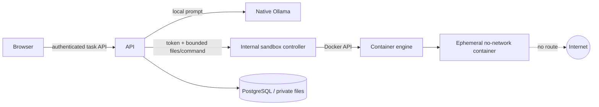

# Day 4 Build Record — Governed Coding Sandbox

Status: complete on 2026-09-13

## Outcome

Day 4 adds a complete safe-coding vertical slice. A user can upload a repository ZIP or supported source files in Workbench, choose **Coding agent**, select a fixed verification command, and receive a verified patch, repository ZIP, and sandbox report. Uploaded source is immutable; all changes occur in a run-scoped working copy.

## End-to-end flow

```mermaid
sequenceDiagram
    actor User
    participant UI as Workbench
    participant API as Governed runtime
    participant Model as Local coder model
    participant Runner as Sandbox controller
    participant Box as Ephemeral container
    participant Store as Artifact store

    User->>UI: Upload ZIP, choose Coding agent, run
    UI->>API: Create coding task
    API->>API: Validate, classify, route, copy repository
    API->>Runner: Run controlled network probe
    Runner->>Box: Start no-network, non-root container
    Box-->>Runner: EGRESS_BLOCKED
    API->>Runner: Run baseline fixed tests
    API->>Model: Goal + bounded repository + failure evidence
    Model-->>API: Unified diff proposal
    API->>API: Validate paths, immutable tests, context and size
    API->>Runner: Run fixed tests on working copy
    Runner->>Box: Read-only repository + bounded /tmp
    Box-->>API: Exit code and bounded output
    API->>Store: Atomically publish three checksum artifacts
    API-->>UI: Durable trace, Markdown result, downloads
```

## Implemented components

- Explicit `auto`, `document`, and `coding` task modes with deterministic capability routing.
- Secure ZIP/source intake with UTF-8, extension, expanded-size, count, traversal, duplicate-path, and symlink checks.
- Run-scoped working copies under the private data volume; cleanup runs on success and failure.
- Repository read/search and bounded patch tools controlled by the coding profile.
- Unified-diff validation that denies deletion, rename, path escape, missing targets, ambiguous context, and test modification.
- A constrained compatibility rule for the 1.5B coder: a single desired line mislabelled as context is normalized only when the surrounding three-line block maps uniquely; final tests remain mandatory.
- Reproducible Ollama generation: the first proposal is greedy, while bounded corrections use low-temperature sampling with attempt-derived seeds to avoid repeating an invalid no-op. At most six model attempts are allowed.
- Separate sandbox controller. The API has no Docker socket; only the controller owns that privileged boundary.
- Ephemeral execution containers with no network, non-root UID 65532, read-only root and repository, dropped capabilities, `no-new-privileges`, PID/CPU/memory/time limits, and bounded output.
- Active network-denial proof before generated-code execution.
- Fixed verification commands: `pytest`, `unittest`, standalone Python execution, or a write-free Python syntax check; arbitrary shell commands are not accepted. When pytest is requested without discoverable tests, one Python file is executed and multiple source files receive a syntax-check fallback.
- Standalone execution reads the repository from a read-only mount and uses a writable ephemeral `/tmp` working directory for normal program outputs. Network, capabilities, process count, CPU, memory, and output remain bounded.
- Small local coders use validated numbered line-range edits. No-op proposals are rejected, syntax-breaking candidates are rolled back, and retry prompts preserve both the validator feedback and current verification failure.
- Atomic publication of patch, verified repository ZIP, and JSON execution report with SHA-256 checksums.
- Live UI activity states and durable execution-trace records for routing, repository isolation, egress proof, baseline, patch attempts, tests, publication, and terminal state.

## Trust boundaries



The controller's Docker socket is a high-privilege prototype boundary. It is isolated from browser traffic and the API by an internal Compose network and a private token. A production deployment should place it on a dedicated host or micro-VM runtime with a mutually authenticated queue/API.

## Acceptance evidence

The final browser acceptance run used `demo/day4-coding/day4-broken-repository.zip` and the goal “Fix the add function defect so the complete test suite passes. Make the smallest safe change.”

| Check | Observed result |
|---|---|
| Route | `qwen2.5-coder:1.5b`, coding profile |
| Repository isolation | 3 files copied to working scope |
| Egress proof | controlled request blocked in `network_mode=none` |
| Baseline | `pytest` exit 1, two expected failures |
| Patch | only `calculator.py`; `left - right` changed to `left + right` |
| Verification | `pytest` exit 0 on attempt 1 |
| Artifacts | patch, repository ZIP, and sandbox JSON downloaded and inspected |
| Cleanup | zero Day 4-labeled execution containers and volumes remained |
| Negative probes | unknown command 422; traversal path 422; timeout is bounded and cleaned |

Automated results:

- Backend: 28 tests passed.
- Ruff: backend, tests, sandbox controller, and sandbox image passed.
- Strict mypy: 51 backend source modules passed when run from `backend/`.
- Frontend lint, TypeScript, Vitest, and production build passed during the Day 4 implementation.
- Browser acceptance confirmed the complete trace and all three artifact downloads.

## Operator demo

1. Run `make up` and open <http://localhost:3000/workbench>.
2. Upload `demo/day4-coding/day4-broken-repository.zip`.
3. Choose **Coding agent** and **pytest -q**.
4. Enter the acceptance goal above and run.
5. Confirm the egress proof, failed baseline, applied patch, passing verification, and three downloads.
6. Open **Audit view** to inspect the persisted task-specific trace.

## Known limits

- The sandbox supports Python verification commands only in Day 4.
- The memory-friendly `qwen2.5-coder:1.5b` can exhaust its bounded correction budget on files with many independent defects. Use focused tests and a stronger registered coding model for reliable semantic repair; exhaustion is reported honestly and no unverified artifact is published.
- Repository intake is capped at 200 supported UTF-8 files and 10 MB expanded by default.
- The controller uses the Docker daemon; stronger VM/kernel isolation is deferred beyond the prototype.
- The API executes one in-process worker task at a time per process; distributed claims and recovery remain future work.
- Passing supplied tests is evidence, not proof that a patch is semantically correct or production-safe; human review of the patch remains required.
