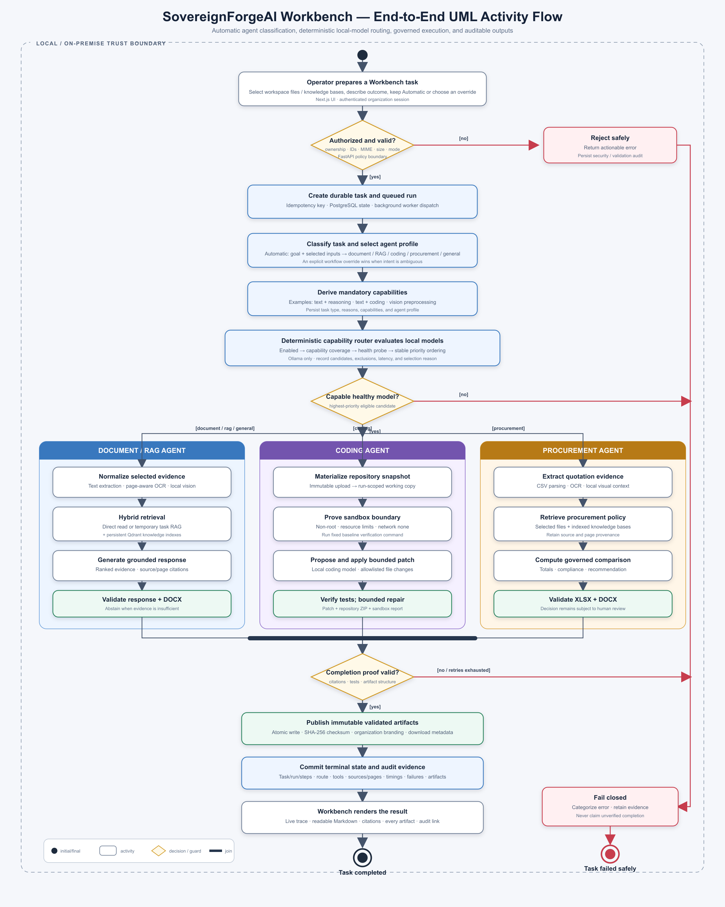

# Workbench UML Flowchart Guide

This document explains every stage in the [SovereignForgeAI Workbench UML activity flowchart](sovereign-ai-workbench-flow.png). Read it from top to bottom alongside the diagram.

## 1. How to read the diagram

The diagram uses standard UML activity notation with draw.io-style presentation:

| Symbol | Meaning |
|---|---|
| Solid circle | Initial state where the workflow begins |
| Rounded rectangle | Activity performed by the user or system |
| Diamond | Decision with labelled guard conditions such as `[yes]` and `[no]` |
| Thick horizontal bar | Join that brings mutually exclusive workflow branches back into one completion path |
| Arrow | Control flow and execution order |
| Bullseye circle | Final state where the run terminates |
| Dashed outer boundary | Local/on-premise trust boundary |
| Blue activity | Platform control-plane activity |
| Green activity | Successful validation or publication activity |
| Red activity/arrow | Rejection or fail-closed path |

Only one of the three agent lanes executes for a task. They are shown side by side so their different controls and outputs can be compared.

## 2. Local/on-premise trust boundary

Everything inside the dashed boundary is designed to execute within the organization's controlled environment. The browser, application services, PostgreSQL, Qdrant, local files, OCR, Ollama models and sandbox runner operate without sending confidential task content to a cloud AI provider.

The boundary is a system-design claim, not merely a UI label. Network restrictions, provider configuration, file containment, tool policies and audit evidence must continue to enforce it.

## 3. Initial state

The solid black circle marks the beginning of a new Workbench task. No task or run record exists yet.

## 4. Operator prepares a Workbench task

The authenticated operator:

1. Selects a workspace.
2. Uploads or selects one or more workspace files when needed.
3. Optionally selects ready knowledge bases.
4. Describes the required outcome in the task prompt.
5. Keeps **Automatic (recommended)** or selects a workflow override.
6. Selects a fixed verification command when explicitly using the Coding workflow.

Automatic mode does not select a fixed model in the browser. It sends the task context to the backend classifier. Explicit Document, Coding and Procurement choices are workflow overrides for cases where a short prompt could be ambiguous.

Inputs remain organization- and workspace-scoped. Selecting a file grants access to that file for this task; it does not grant unrestricted filesystem access.

## 5. Decision: Authorized and valid?

The FastAPI boundary validates the request before execution.

Checks include:

- authenticated user and active session;
- workspace ownership by the user's organization;
- selected file and knowledge-base ownership;
- file availability and non-deleted state;
- allowed task mode and requested output types;
- required inputs for explicit Coding or Procurement mode;
- file MIME type, extension, size and safe storage identity during upload;
- request schema, length and collection limits.

### Guard `[yes]`

The request is accepted and moves to durable task creation.

### Guard `[no]` — Reject safely

The API returns an actionable validation or authorization error. It does not start model inference or tool execution. Relevant security or validation evidence is retained in the audit trail where applicable.

Examples include a file from another organization, an unsupported upload, a missing coding input or an invalid artifact request.

## 6. Create durable task and queued run

The task service creates persistent PostgreSQL records before background work begins:

- a `Task` containing the goal, mode and selected resource IDs;
- a queued `TaskRun` with an attempt number and deadline;
- the initial audit and lifecycle information.

An idempotency key prevents an accidental repeated submission from creating duplicate work. The API returns the task and run IDs immediately, while the background worker performs the longer execution.

The Workbench polls the durable task state, so refreshing the browser does not become the source of truth for execution.

## 7. Classify task and select agent profile

The classifier evaluates the requested mode, goal and supplied context.

In Automatic mode it can select:

| Classification | Agent profile | Typical signal |
|---|---|---|
| `general` | General agent | A task without document, coding or procurement intent |
| `document_analysis` | Document agent | Selected files or inspection/document language |
| `rag` | Document agent | Selected knowledge bases or policy/manual language |
| `coding` | Coding agent | Code, bug, fix, test or repository intent |
| `procurement` | Procurement agent | Quotation, vendor, procurement, bids or spreadsheet-comparison intent |

An explicit workflow override takes precedence. This is useful when the goal contains overlapping words, such as a procurement quotation mentioning software code.

The selected task type, agent profile, capabilities and classification reasons are written to the run trace.

## 8. Derive mandatory capabilities

The classification is translated into capabilities a model must provide:

- general, document and procurement reasoning require `text` and `reasoning`;
- coding requires `text` and `coding`;
- image and scanned-page understanding uses a registered `vision` model as a bounded preprocessing step;
- embeddings use the configured local embedding model for semantic retrieval.

Capabilities are requirements, not model preferences. A model missing one mandatory capability cannot become the primary task model even if it has higher priority.

## 9. Deterministic capability router evaluates local models

The router loads enabled models from the registry and evaluates each candidate in a stable order.

For every candidate it records:

- model ID and Ollama model key;
- configured priority;
- required capabilities that are missing;
- whether the candidate is eligible;
- live health status and probe latency when evaluated;
- an exclusion reason when relevant.

The first healthy model in deterministic priority order that covers every mandatory capability is selected. Vision models are reserved for visual preprocessing unless the primary task explicitly requires that capability, preventing a vision model from unintentionally replacing the normal reasoning model.

There is no required model dropdown in the Workbench. The displayed model changes from **Automatic** to the persisted selected model after routing.

## 10. Decision: Capable healthy model?

### Guard `[yes]`

The selected model ID, key, candidate evaluation and selection reason are persisted. Execution enters exactly one agent workflow lane.

### Guard `[no]`

The run fails closed with `NO_CAPABLE_MODEL`. It does not silently select a disabled, unhealthy or capability-incompatible model. The operator can inspect candidate exclusions on the Trace or Model Registry screen.

## 11. Document/RAG agent lane

This lane handles general responses, document analysis, inspection evidence and questions grounded in knowledge bases.

### 11.1 Normalize selected evidence

Each selected file is resolved by its server-side ID and checked against the workspace. Supported digital documents are parsed into normalized, page-aware text.

For scanned PDFs and images:

- offline OCR extracts readable text;
- a healthy local vision model may add bounded visual context;
- configured page and pixel limits control memory use;
- OCR-only fallback is recorded explicitly when vision is unavailable.

The normalized representation retains the file identity, checksum, page number and extraction method.

### 11.2 Hybrid retrieval

The evidence strategy depends on the selected inputs:

- a small selected file can be read directly;
- large or multiple selected files use temporary task-scoped semantic retrieval;
- selected ready knowledge bases search their active Qdrant index versions;
- direct, temporary and persistent results are merged and globally bounded.

Temporary Workbench retrieval does not require the user to index a newly uploaded file first. Knowledge bases remain valuable for reusable, versioned collections shared across many tasks.

### 11.3 Generate grounded response

The selected local reasoning model receives the task plus only the bounded evidence assembled by retrieval. The prompt requires material claims to use supplied source IDs.

Every citation maps back to a real selected file or knowledge-base document and its page range. Unknown or fabricated citation IDs are not accepted as grounded evidence.

### 11.4 Validate response and DOCX

The result must satisfy grounding and output rules. If evidence cannot support the requested conclusion, the response must abstain or require human review instead of inventing facts.

When requested, the artifact service renders an organization-branded DOCX from controlled structured content, checks the Office package and required sections, and prepares it for publication.

## 12. Coding agent lane

This lane performs bounded repository changes without altering the original uploaded source.

### 12.1 Materialize repository snapshot

Selected source files or a repository ZIP are copied into a run-scoped working directory. Archive paths, file counts and total expanded size are validated. The original upload remains immutable.

Automatic coding tasks ignore selected knowledge bases because knowledge documents are not copied into the code sandbox. Explicit Coding mode requires the operator to deselect them, making the boundary visible before submission.

### 12.2 Prove sandbox boundary

The runner starts an ephemeral container with:

- no network access;
- a non-root user;
- dropped Linux capabilities;
- memory, CPU, process and time limits;
- only the run-scoped repository mounted;
- a fixed server-defined verification command.

An egress probe demonstrates that the sandbox cannot reach an external network. The baseline command then records the repository's original behavior.

### 12.3 Propose and apply bounded patch

The local coding model receives the task, bounded repository context and verification evidence. Its proposed change is parsed and constrained to allowed paths inside the working copy.

Raw shell commands from the model are not executed. The application owns the command allowlist, patch application and path containment checks.

### 12.4 Verify tests and bounded repair

The sandbox runs the selected verification command against the changed working copy. A failed attempt can be supplied back to the coding model for a limited repair attempt.

Completion requires verification to pass and a real repository change to exist. If those conditions hold, the workflow prepares:

- a unified patch;
- the verified repository ZIP;
- a structured sandbox report containing commands, status and boundary evidence.

If retries are exhausted, the workflow follows the fail-closed path and does not claim that the code was fixed.

## 13. Procurement agent lane

This lane compares vendor quotations against explicit policy and creates governed business deliverables.

### 13.1 Extract quotation evidence

Quotation inputs are normalized from supported CSV, text, PDF or image evidence. CSV columns use defined aliases and strict numeric/boolean parsing. OCR and local vision can supply evidence from scanned or visual pages.

Missing fields remain missing; the system does not invent vendor values.

### 13.2 Retrieve procurement policy

Policy evidence is read from selected files and selected indexed knowledge bases. Applicable requirements can include budget, maximum delivery time, minimum warranty and required currency.

Source IDs and page provenance remain attached to the evidence used for comparison.

### 13.3 Compute governed comparison

Deterministic application code calculates:

- quotation line totals;
- total evaluated cost per vendor;
- delivery and warranty compliance;
- policy exceptions and review reasons;
- the recommended compliant vendor.

The local model may provide bounded review assistance, but it cannot overwrite computed totals, compliance status or the authoritative recommendation.

### 13.4 Validate XLSX and DOCX

The workflow generates both deliverables atomically:

- a formatted XLSX containing the recommendation, quotation lines and policy controls;
- an organization-branded DOCX recommendation with evidence and human-review language.

The files are opened and structurally validated before publication. Procurement output always remains subject to human approval.

## 14. Join workflow branches

The thick horizontal bar is a UML join. It brings the selected agent lane back into the common completion path.

It does not mean the three agents run in parallel. One classification produces one primary lane; all lanes must satisfy the same platform-level completion controls afterward.

## 15. Decision: Completion proof valid?

The completion validator ignores a model's unsupported claim of success and checks workflow-specific evidence.

| Workflow | Required proof |
|---|---|
| Document/RAG | Grounded result, valid source references and valid requested DOCX |
| Coding | Real change, passing bounded verification and valid patch/repository/sandbox artifacts |
| Procurement | Deterministic comparison plus valid XLSX and DOCX outputs |

### Guard `[yes]`

The run can publish its validated deliverables.

### Guard `[no / retries exhausted]`

The run enters the fail-closed path. Partial or failed evidence stays inspectable, but the UI must not present it as verified completion.

## 16. Publish immutable validated artifacts

Artifact publication follows an atomic process:

1. Render to a temporary run-scoped path.
2. Validate the file package and required content.
3. Calculate its SHA-256 checksum.
4. Move it to immutable workspace artifact storage.
5. Commit artifact metadata only after validation succeeds.

If a required artifact in an atomic set fails, the set is not published as complete. The checksum displayed in the Workbench allows an operator to verify the downloaded file.

## 17. Commit terminal state and audit evidence

The worker commits the final task/run status and append-only evidence, including:

- classification and agent profile;
- model candidates and selected route;
- authorized tools and bounded arguments;
- accessed files, knowledge bases, source IDs and pages;
- step ordering, durations and retry counts;
- sandbox results or policy denials;
- artifact metadata and checksums;
- categorized error details when the run fails.

PostgreSQL is authoritative for execution state and audit metadata. Qdrant stores reusable knowledge vectors, while the local filesystem stores uploads, normalized extracts and published artifact bytes.

## 18. Workbench renders the result

The browser polls the task endpoint while the run is active and displays committed steps in the live trace.

On completion it renders:

- the model selected by the router;
- readable Markdown rather than raw Markdown syntax;
- source and page citations;
- every generated artifact with size, validation status and checksum;
- a link to the durable Trace view.

The browser presents backend state; it does not decide whether a task succeeded.

## 19. Successful final state

The black bullseye means the task completed with valid workflow-specific proof. A green badge or `VERIFIED LOCAL` label is appropriate only after this state has been committed.

## 20. Shared fail-closed path

Authorization failure, unavailable required models, denied tools, invalid model output, failed tests, invalid artifacts, exhausted retries, cancellation and timeouts all converge on controlled failure handling.

The system:

1. stops unsafe or invalid progress;
2. assigns a clear failure category;
3. retains safe diagnostic and audit evidence;
4. avoids publishing incomplete required artifacts;
5. reports an actionable error without exposing secrets;
6. never converts an unverified model statement into a successful status.

The red bullseye marks the terminal **Task failed safely** state. A failed run remains visible in the Trace page so an operator can correct its inputs, model readiness or configuration and submit a new task.

## 21. Cross-cutting controls

These controls apply throughout the flow rather than belonging to one diagram node.

### Organization isolation

Every workspace, file, knowledge base, task, run and artifact query is scoped to the authenticated organization. Browser-supplied IDs are never treated as proof of ownership.

### Bounded execution

Task deadlines, retry limits, evidence limits, image pixel/page limits, context budgets, sandbox resources and artifact validation keep work predictable on the target MacBook Air M1 with 8 GB unified memory.

### Human authority

The system provides decision support. Inspection approval, procurement awards and consequential code deployment remain human decisions. Generated documents preserve caveats and review requirements.

### Observability and reproducibility

Deterministic classification rules, stable routing order, immutable input checksums, recorded model keys, fixed commands and artifact hashes make runs explainable and repeatable.

### Data sovereignty

All task content is processed by local services and locally served open-weight models. The coding sandbox has an explicit no-network boundary, and platform egress controls and probes provide additional sovereignty evidence.

## 22. Quick walkthrough example

For a prompt such as “Compare these vendor quotations against our procurement policy and prepare a recommendation”:

1. The operator selects quotation and policy files and leaves the workflow on Automatic.
2. Validation confirms the user owns the workspace inputs.
3. The task and queued run are persisted.
4. The classifier selects `procurement` and the `procurement_agent` profile.
5. The router selects a healthy local text-and-reasoning model.
6. The procurement lane extracts quotation values and retrieves policy evidence.
7. Deterministic code calculates totals and compliance.
8. The model performs a bounded review without controlling the computed recommendation.
9. The XLSX and DOCX are rendered and validated.
10. Checksums, sources, steps and routing evidence are persisted.
11. The Workbench displays the recommendation, citations, downloads and audit link.
12. The task reaches the successful final state only if all mandatory proof is valid.
