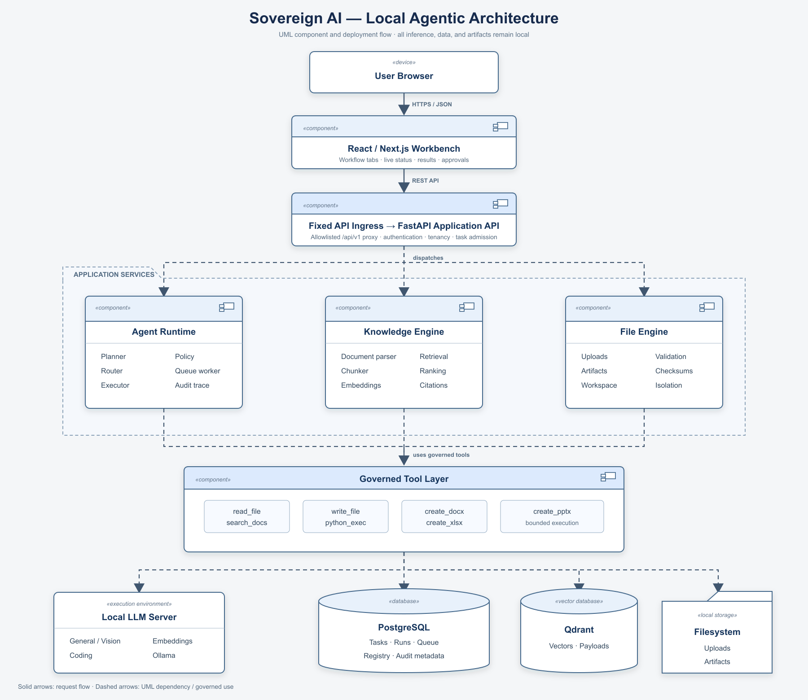

# Architecture Flowchart Guide

This guide explains the [Sovereign AI architecture flowchart](sovereign-ai-architecture-flowchart.png). The editable source is [sovereign-ai-architecture-flowchart.svg](sovereign-ai-architecture-flowchart.svg).

## Notation

- Rectangles marked `«component»` are deployable or logical UML components.
- `«device»` identifies the user's browser.
- Cylinders represent persistent databases; the tabbed shape represents local filesystem storage.
- Solid arrows carry user requests. Dashed arrows show governed dependencies rather than unrestricted access.
- The dashed `APPLICATION SERVICES` package is the modular-monolith service boundary.

## Top-to-bottom flow

1. **User Browser** — the operator starts a task, uploads evidence, reviews live trace events, and downloads validated artifacts.
2. **React / Next.js Workbench** — provides workflow tabs, model auto-routing controls, task state, approvals, Markdown results, previews, and downloads. It contains presentation state only.
3. **Fixed API Ingress → FastAPI Application API** — ingress forwards only `/api/v1` requests to a fixed internal API upstream. FastAPI authenticates the user, enforces organization/workspace scope, validates requests, creates tasks, and exposes status and audit data.
4. **Application Services** — FastAPI dispatches work to three bounded domains:
   - **Agent Runtime:** classifies, plans, auto-routes a capable local model, authorizes tools, executes bounded steps, handles cancellation, and writes the audit trace.
   - **Knowledge Engine:** parses files, performs OCR when needed, chunks deterministically, embeds locally, retrieves and ranks evidence, and produces page-aware citations.
   - **File Engine:** validates uploads, applies workspace isolation, computes checksums, and publishes immutable artifact metadata.
5. **Governed Tool Layer** — agents request named tools through policy checks. Read/search, file writing, office generation, and Python execution have explicit schemas and bounded permissions; model text never becomes unrestricted host access.
6. **Local Infrastructure** — governed dependencies fan out to native Ollama through the allowlisted Ollama gateway, PostgreSQL for durable control-plane state, Qdrant for vectors, and task-scoped filesystem storage.

## Security boundaries omitted from the simplified picture

The image stays readable by grouping several deployment controls. In the running Compose topology, the API, data plane, and sandbox control plane are separate internal networks. Ephemeral code containers use `network_mode: none`, a read-only root filesystem, a non-root user, dropped capabilities, and CPU/memory/PID/time limits. The API cannot make a general internet request; only the fixed Ollama gateway has the narrow host route required to reach local native inference.

## How to use the diagram

- **Product/demo:** follow the solid path, then explain that each generated answer and artifact returns with traceable evidence.
- **Engineering:** use the component boundaries to locate ownership before changing code.
- **Security review:** validate every dashed dependency against its network, authorization, path, resource, and audit control.
- **Incident review:** start with task/run IDs in PostgreSQL, correlate audit events and citations, then verify artifact checksums and task-scoped files.

The diagram is architectural, not a sequence chart: retries, cancellation, retrieval branching, workflow-specific validation, and error states are detailed in [the Workbench activity flow](sovereign-ai-workbench-flow.png) and its [stage guide](26-workbench-flowchart-guide.md).
