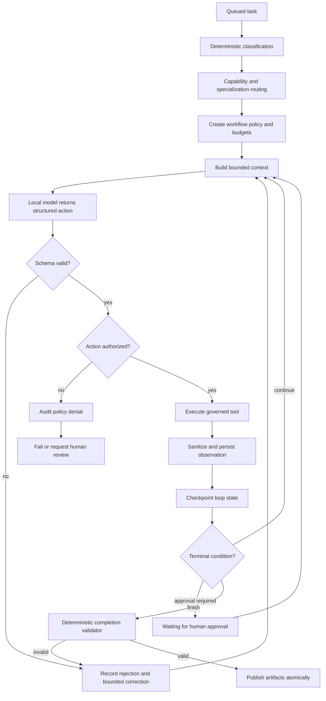

It covers:

  - Constrained ReAct architecture
  - Coding-model routing improvements
  - Reason → Act → Observe execution loop
  - Iteration, timeout and token limits
  - Tool security and observation sanitization
  - Queueing and concurrency for an M5 Mac with 16 GB RAM
  - Human approval and resumable workflows
  - Persistence and proposed API changes
  - Phased rollout, beginning with coding workflows
  - Testing, metrics, risks and acceptance criteria


# Constrained ReAct and Agent Loop Engineering Plan

Status: proposed; no implementation is authorized by this document  
Target deployment: local-first Ollama node, beginning with the M5 16 GB profile  
Primary objective: improve workflow adaptability and recovery without weakening deterministic policy, isolation, evidence, or audit controls

## Executive decision

Adopt a **constrained ReAct cycle inside an application-controlled loop**. The model may recommend one action at a time from a workflow-specific allowlist, but application code remains responsible for model routing, authorization, argument validation, tool execution, observation sanitization, budgets, completion validation, and terminal state changes.

This is deliberately not an unrestricted autonomous agent. ReAct is used only where an observation can materially improve the next decision.

```text
Application-controlled loop
  ├── deterministic classification and model routing
  ├── workflow policy and budgets
  ├── constrained ReAct decision
  │     ├── select one allowed action
  │     ├── provide a short reason summary
  │     └── declare expected evidence
  ├── deterministic authorization and execution
  ├── sanitized observation and checkpoint
  └── deterministic completion validator
```

## Current baseline

The current runtime already provides most of the safety shell required for a controlled loop:

- durable tasks, attempts, steps, artifacts, and audit events in PostgreSQL;
- deterministic task classification and capability-based model routing;
- filename-aware detection of source-code inputs;
- workflow-specific tool authorization through `ToolRegistry`;
- bounded tool timeouts, step limits, retry limits, and task deadlines;
- organization and workspace isolation;
- no-network coding sandbox and fixed verification commands;
- citation-aware document generation;
- deterministic procurement calculations and artifact validation;
- a database-backed local FIFO worker with one active governed run;
- cancellation checks between governed operations.

The coding workflow is already ReAct-like: it proposes a patch, applies it, observes compilation/test output, and makes another bounded attempt. Document workflows are currently more linear: retrieve once, generate once, validate, and publish.

## Goals

1. Improve coding repair quality by letting the model inspect targeted files and react to structured verification results.
2. Improve document answers through bounded query reformulation and evidence sufficiency checks.
3. Invoke OCR and vision selectively when deterministic extraction is incomplete or uncertain.
4. Add safe human-review pauses for ambiguity and high-impact decisions.
5. Persist enough state to explain, replay, resume, and evaluate every loop iteration.
6. Reduce unnecessary prompt context while maintaining or improving completion quality.
7. Preserve a predictable operating profile on a 16 GB local machine.

## Non-goals

- Exposing or storing private chain-of-thought.
- Allowing the model to choose arbitrary URLs, commands, paths, models, or tools.
- Allowing ReAct to control authentication, authorization, tenancy, queue scheduling, or model eligibility.
- Replacing deterministic procurement arithmetic or compliance evaluation with model judgment.
- Allowing generated tests to replace immutable verification tests.
- Claiming improved speed before measurement; multiple ReAct iterations may increase latency.
- Running multiple simultaneous Ollama generations on the M5 by default.
- Introducing Kubernetes, Redis, or a cloud model dependency for the first implementation.

## Proposed architecture



### Ownership boundaries

| Decision | Owner |
|---|---|
| Task type and required capabilities | Deterministic classifier |
| Eligible and selected model | Model router and registry metadata |
| Available actions | Workflow policy |
| Proposed next action | Local model |
| Action schema validity | Application validator |
| Tool authorization | Tool registry and agent profile |
| Tool execution | Application tool adapter |
| Observation size and visibility | Sanitizer and policy |
| Continue, pause, or terminate | Loop controller |
| Whether the task actually succeeded | Deterministic completion validator |

## Structured action contract

The model must return one JSON action envelope. Free-form text outside the envelope is rejected.

```json
{
  "action": "search_knowledge",
  "arguments": {
    "query": "pump isolation lockout verification",
    "knowledge_base_ids": ["approved-id"]
  },
  "reason_summary": "The current evidence does not contain the required lockout control.",
  "expected_evidence": "A policy passage describing isolation verification.",
  "confidence": 0.74
}
```

Requirements:

- `action` must be an enum defined by the active workflow policy.
- `arguments` must use a separate strict schema for each action.
- IDs and paths must be selected from server-supplied permitted values.
- `reason_summary` is a concise decision explanation, not hidden reasoning.
- `expected_evidence` is used to evaluate whether the action was useful.
- `confidence` is advisory and never overrides policy or validation.
- Unknown properties, excessive strings, nested instructions, and multiple actions are rejected.

### Common terminal actions

```text
finish
request_human_review
report_insufficient_evidence
```

`finish` is only a request to validate completion. It cannot directly mark a task completed.

## Engineered loop controls

Every workflow policy should define:

| Control | Initial policy |
|---|---|
| Maximum ReAct iterations | Coding: 6; document: 4; multimodal: 3 |
| Maximum model corrections for invalid actions | 1 per iteration |
| Maximum identical action signature | 2 |
| Maximum total tool calls | Workflow-specific and below task step limit |
| Maximum observation characters | Per-tool bound plus total context bound |
| Maximum retrieved evidence | Existing evidence hit and character limits |
| Execution deadline | Starts when the worker begins the run |
| Queue age | Separate future limit; must not consume execution deadline |
| Cancellation | Checked before and after every model/tool operation |
| Human review | Pauses without consuming an execution worker |

### Required loop-break conditions

The controller must terminate or pause when any of these occurs:

- maximum iterations, steps, retries, tokens, or deadline reached;
- cancellation requested;
- identical action and materially identical observation repeat twice;
- the model selects an unauthorized action;
- an observation shows an irreversible or policy-sensitive choice is required;
- evidence remains insufficient after the search budget;
- a deterministic completion validator succeeds;
- a non-retryable tool, dependency, validation, or security error occurs.

The loop must never rely on the model to stop itself.

## Observation contract

Tool output must be converted into a bounded observation before returning it to the model.

```json
{
  "action_id": "uuid",
  "tool": "run_python_tests",
  "status": "failed",
  "summary": "2 tests failed in calculator.py",
  "facts": {
    "exit_code": 1,
    "failed_tests": ["test_tax_total", "test_empty_order"]
  },
  "evidence_refs": ["artifact-or-step-id"],
  "truncated": false,
  "duration_ms": 842
}
```

Observation processing must:

- remove secrets, host paths, environment values, and unrelated output;
- distinguish trusted application facts from untrusted document/tool text;
- preserve full evidence separately when audit policy permits;
- pass only bounded summaries and references back into the next model prompt;
- record truncation explicitly;
- treat document contents and tool output as data, never as agent instructions.

## Workflow-specific application

### Phase 1: coding repair loop

This is the first implementation target because the current workflow already contains an action-observation retry cycle.

Proposed action set:

| Action | Purpose | Key restrictions |
|---|---|---|
| `list_repository` | Inspect permitted paths and sizes | No content and no ignored directories |
| `read_repository_file` | Read a targeted source file | Repository-relative allowlisted path; character bound |
| `search_repository` | Locate symbols or error text | Fixed-string/escaped search; result limit |
| `propose_patch` | Return structured line edits | Existing patch parser and size/path policy |
| `apply_patch` | Apply validated edits | Cannot modify verification files |
| `run_verification` | Compile or run selected tests | Fixed server-approved command only |
| `finish` | Request completion validation | Requires non-empty diff and passing verification |
| `request_human_review` | Pause on ambiguity | Requires concise actionable question |

Planned improvements:

- stop sending the entire repository when targeted reads are sufficient;
- let verification observations guide the next file read or patch;
- detect repeated patches and repeated failures;
- keep a known-good snapshot and roll back invalid candidates;
- require syntax validation before expensive full verification;
- preserve immutable tests and no-network sandbox enforcement;
- compare quality and latency with the current repair implementation behind a feature flag.

### Phase 2: adaptive document and knowledge retrieval

Proposed action set:

| Action | Purpose | Key restrictions |
|---|---|---|
| `inspect_available_sources` | View permitted file/KB metadata | No cross-workspace identifiers |
| `search_knowledge` | Retrieve relevant indexed passages | Selected knowledge bases only |
| `read_file_section` | Inspect a bounded page/section | Selected files only |
| `reformulate_query` | Produce the next retrieval query | Query length and iteration limits |
| `assess_evidence` | Declare coverage and gaps | Must cite evidence IDs |
| `finish` | Request grounded response validation | Material claims require citations |
| `report_insufficient_evidence` | End safely | Must name the unresolved evidence gap |

Planned improvements:

- allow one or two query reformulations when initial retrieval is weak;
- support multi-part questions with an explicit evidence checklist;
- stop retrieval early when coverage thresholds are met;
- detect citation gaps before document generation;
- prevent query drift beyond the original task;
- include retrieved-source diversity and relevance in evaluation.

### Phase 3: selective OCR and vision

Proposed actions:

```text
inspect_extraction_summary
run_ocr_on_pages
inspect_visual_pages
compare_extractions
request_human_review
finish
```

Vision must be triggered by deterministic signals such as missing text, table structure, OCR confidence, or conflicting extracted values. The model cannot request arbitrary pages beyond the configured page budget.

Expected improvements:

- fewer unnecessary vision-model loads;
- lower memory churn with one loaded Ollama model;
- better handling of scanned tables and quotation layouts;
- explicit escalation when OCR and vision disagree.

### Procurement boundary

ReAct may gather or clarify evidence, but it must not calculate or choose the governed award result.

Keep deterministic:

- currency and unit normalization;
- line totals and aggregate totals;
- mandatory compliance rules;
- scoring and tie handling;
- selected/recommended vendor;
- XLSX and DOCX validation.

The model may only produce review notes, identify missing evidence, or request human confirmation.

## Human approval and resumption

Introduce a future `waiting_approval` state with a structured approval request:

```json
{
  "question": "Does the quoted total include tax?",
  "reason": "The table and footer contain conflicting totals.",
  "allowed_responses": ["tax_included", "tax_excluded", "cancel"],
  "evidence_refs": ["S2", "S5"]
}
```

Requirements:

- persist the checkpoint before releasing the worker;
- do not keep Ollama or a worker slot occupied while waiting;
- authorize the responding user against the task organization;
- record the response as an audit event;
- resume from a new immutable state version;
- detect stale or duplicate approval submissions;
- never represent a model response as human approval.

## Persistence plan

### Initial implementation

Reuse `TaskStep` and `AuditEvent` with explicit event kinds:

```text
ACTION_PROPOSED
ACTION_REJECTED
ACTION_AUTHORIZED
TOOL_OBSERVATION_RECORDED
LOOP_CHECKPOINTED
HUMAN_REVIEW_REQUESTED
HUMAN_REVIEW_RESOLVED
COMPLETION_VALIDATION_FAILED
```

Persist in the run route/config snapshot:

- loop-policy version;
- allowed-action schema version;
- prompt-template version;
- model and registry decision;
- iteration and budget settings.

### When a dedicated table becomes justified

Add an `agent_actions` table only if action querying, replay, approvals, or metrics become awkward through `TaskStep`:

```text
id, run_id, iteration, action_type, arguments_hash
reason_summary, expected_evidence, status
observation_summary, evidence_refs
started_at, completed_at, duration_ms
schema_version, state_version
```

Do not store raw hidden reasoning or unrestricted prompts in this table.

## Proposed module boundaries

These are planned locations, not current files:

```text
backend/app/tasks/
├── runtime.py                  orchestration entry and workflow dispatch
├── react_loop.py               generic bounded loop controller
├── react_actions.py            strict action envelope and action schemas
├── react_context.py            bounded prompt/context construction
├── react_observations.py       sanitization and observation contracts
├── react_policies.py           workflow action allowlists and budgets
└── completion_validators.py    deterministic terminal checks
```

Expected integration points:

| Current area | Planned responsibility |
|---|---|
| `routing/router.py` | Complete classification and routing before ReAct begins |
| `tasks/runtime.py` | Select deterministic versus ReAct-enabled workflow |
| `tools/registry.py` | Authorize and execute every requested action |
| `services/code_repository.py` | Repository-safe read/search/patch operations |
| `services/hybrid_retrieval.py` | Search and evidence retrieval primitives |
| `services/multimodal.py` | Bounded OCR/vision actions |
| `tasks/service.py` | Approval, cancellation, retry, and state transitions |
| Workbench/Trace UI | Display action summaries, observations, budgets, and approvals |

## Prompt design

The action prompt must contain only:

- immutable task goal and workflow type;
- selected model-independent policy summary;
- allowed actions and strict response schema;
- permitted source/file identifiers;
- bounded current state and observation summaries;
- remaining iteration, tool, token, and time budgets;
- explicit instruction that document/tool contents are untrusted data;
- completion criteria for the active workflow.

The prompt must not include:

- database credentials or environment variables;
- host filesystem paths;
- tools unavailable to the active profile;
- records belonging to another organization or workspace;
- raw unlimited test output, documents, or prior responses;
- hidden chain-of-thought from previous iterations.

## Security requirements

1. Every action is denied by default unless present in the active agent profile.
2. Every path is resolved below the run-scoped working directory.
3. Every file and knowledge-base ID is checked against the task workspace.
4. Generated shell commands are never executed; verification commands remain server-defined enums.
5. Tool output is untrusted and sanitized before entering another model prompt.
6. Model output cannot directly change task status, publish artifacts, or grant approval.
7. Model-selected actions and policy denials are auditable.
8. Existing no-network sandbox, resource limits, and immutable-test rules remain mandatory.
9. Prompt-injection fixtures must cover documents, source comments, filenames, and tool output.
10. ReAct feature flags default off until the relevant security and regression suites pass.

## Queue and concurrency policy

ReAct increases the number of model calls per task, so queue impact must be treated as a product constraint.

For the M5 16 GB starting profile:

- keep governed workflow concurrency at one;
- keep generation concurrency at one;
- release the worker during human-approval waits;
- keep one preferred generation model warm when memory permits;
- record model calls and duration per iteration;
- cap total model calls per workflow;
- show that a running task is in an iterative phase without exposing hidden reasoning;
- do not increase concurrency until mixed-workload measurements pass.

Before ten-user certification, add durable leases, queue-age limits, admission limits, fairness, and a shared model permit as described in the scaling plan.

## User experience and trace

The Workbench should present understandable progress:

```text
1. Repository inspected
2. Baseline verification failed
3. Targeted source file read
4. Patch applied
5. Verification passed
6. Completion validated
```

For each iteration, display:

- action name and status;
- concise reason summary;
- sanitized observation summary;
- duration;
- citations or artifact references;
- remaining attempts when useful;
- approval request when the workflow pauses.

Never label raw model reasoning as an audit explanation. The UI should use terms such as `Decision summary`, `Action`, and `Observation` rather than `Thought` or `Chain of thought`.

## Feature flags and rollout

Proposed flags:

```text
REACT_CODING_ENABLED=false
REACT_DOCUMENT_ENABLED=false
REACT_MULTIMODAL_ENABLED=false
REACT_MAX_TOTAL_MODEL_CALLS=6
```

Rollout procedure:

1. Record baseline results using the current deterministic workflow.
2. Enable ReAct only for fixed internal evaluation tasks.
3. Compare results using identical models, seeds, files, and verification commands.
4. Enable for organization owners on a test workspace.
5. Expand only when quality improves without violating latency, reliability, or security thresholds.
6. Retain immediate rollback to the deterministic workflow.

## Delivery phases

### Phase 0: contracts and evaluation baseline

Estimated effort: 1–2 engineering days.

- Freeze representative coding, document, multimodal, and procurement fixtures.
- Record current completion rate, latency, model calls, tokens, retries, and artifact validity.
- Finalize action, observation, policy, and completion schemas.
- Define feature flags and policy versions.
- Add architecture/security review for action boundaries.

Exit criteria: schemas approved and a reproducible deterministic baseline exists.

### Phase 1: constrained coding ReAct

Estimated effort: 3–5 engineering days.

- Extract the existing repair cycle behind a common loop interface.
- Add targeted repository listing, reading, and searching.
- Require structured actions and validate every argument.
- Add repetition detection, budget enforcement, and completion validation.
- Preserve rollback, immutable tests, fixed commands, and sandbox isolation.
- Add trace events and side-by-side evaluation.

Exit criteria: improved or equal verified test-pass rate with no security regression and bounded latency.

### Phase 2: adaptive document retrieval

Estimated effort: 3–4 engineering days.

- Add evidence checklist and sufficiency contract.
- Add bounded query reformulation and targeted section reads.
- Add citation-completeness validation and insufficient-evidence termination.
- Evaluate retrieval relevance, source diversity, and grounded-answer correctness.

Exit criteria: citation quality improves over one-shot retrieval without unacceptable queue growth.

### Phase 3: human review and resumable checkpoints

Estimated effort: 3–5 engineering days.

- Add `waiting_approval` state and approval APIs.
- Persist resumable loop checkpoints.
- Release worker capacity while waiting.
- Add authorization, stale-response protection, audit events, and UI controls.
- Verify recovery across backend restart.

Exit criteria: a paused workflow resumes exactly once from the approved checkpoint.

### Phase 4: selective multimodal actions

Estimated effort: 2–4 engineering days.

- Add deterministic triggers for OCR and visual inspection.
- Add page budgets and extraction comparison.
- Escalate conflicts instead of guessing.
- Measure model swaps, peak memory, latency, and extraction accuracy.

Exit criteria: extraction quality improves while vision calls and memory remain bounded.

### Phase 5: production hardening

Estimated effort: 4–7 engineering days plus load testing.

- Add worker leases, heartbeat, queue age, fairness, and idempotent action claims.
- Add shared generation/embedding admission control.
- Add action-level metrics, alerts, replay tooling, and recovery tests.
- Run one-, two-, five-, and ten-user mixed/burst tests.
- Update operational and capacity documentation with measured results.

Exit criteria: no lost or duplicated actions under restart and concurrency tests; published capacity targets pass.

## Test plan

### Unit tests

- valid and invalid action envelopes;
- unknown action and unknown argument rejection;
- workflow-specific action allowlists;
- path, workspace, and identifier validation;
- observation truncation and secret removal;
- loop budgets and deadline checks;
- repeated action/observation detection;
- deterministic completion validators;
- prompt-injection content treated as data;
- explicit workflow override behavior.

### Workflow integration tests

- coding: targeted read → patch → failed test → corrected patch → passing test;
- coding: repeated invalid patch terminates within budget;
- document: weak search → reformulation → cited completion;
- document: missing evidence ends with `insufficient_evidence`;
- multimodal: OCR uncertainty → selected vision pages → normalized result;
- procurement: model cannot alter deterministic totals or selected vendor;
- approval: pause → authorized response → single resume;
- cancellation before model, during tool boundary, and while waiting for approval;
- restart from each persisted safe checkpoint.

### Security tests

- source comment attempts to request another tool;
- document prompt injection requests secrets or network access;
- generated absolute and traversal paths;
- generated arbitrary shell commands;
- cross-workspace file and knowledge IDs;
- oversized action, observation, patch, and query payloads;
- attempt to modify tests or sandbox configuration;
- action replay and duplicate completion;
- unauthorized approval response.

### Evaluation suite

Run deterministic and ReAct variants with the same model and inputs. Record at least ten repetitions per fixed task before accepting a quality claim.

## Success metrics

| Metric | Desired direction | Guardrail |
|---|---|---|
| Verified coding completion rate | Increase | No immutable-test or sandbox violations |
| First valid patch rate | Increase | No larger unsafe patches |
| Document citation precision/coverage | Increase | No unsupported material claims |
| Insufficient-evidence accuracy | Increase | Do not manufacture an answer |
| Vision pages per task | Decrease or remain bounded | Extraction accuracy must not fall |
| Mean model calls per completed task | Remain bounded | Respect per-workflow cap |
| p50/p95 end-to-end latency | Measure | Must meet approved workflow target |
| Queue wait and depth | Measure | No sustained unbounded growth |
| Repeated-action termination | 100% | Must stop within configured limit |
| Restart recovery correctness | 100% | No duplicate tools or artifacts |
| Policy-denial handling | 100% safe | No unauthorized action executes |

## Acceptance criteria

- [ ] ReAct is feature-flagged and disabled by default during development.
- [ ] Every model action uses a strict versioned schema.
- [ ] Every tool call passes through the existing authorization boundary.
- [ ] No raw hidden chain-of-thought is stored or displayed.
- [ ] Action and observation sizes are bounded and sanitized.
- [ ] Coding completion still requires immutable verification to pass.
- [ ] Document completion still requires evidence-linked citations.
- [ ] Procurement decisions remain deterministic.
- [ ] Cancellation, timeout, retry, and repetition limits are enforced outside the model.
- [ ] Human-review waits release worker/model capacity.
- [ ] Restart tests prove safe resume or explicit safe restart behavior.
- [ ] The deterministic workflow remains available for rollback.
- [ ] Quality gains are demonstrated using fixed evaluation data.
- [ ] Latency, memory, queue, and model-call costs are published with the results.

## Risks and mitigations

| Risk | Mitigation |
|---|---|
| More model calls increase latency | Small iteration caps, early completion, targeted context, measured rollout |
| Model repeats ineffective actions | Action-signature and observation-similarity detection |
| Prompt injection influences tool choice | Treat evidence as untrusted data; strict action and policy validation |
| Invalid structured output | One bounded correction, then safe failure or deterministic fallback |
| Context grows every iteration | Summary/reference model and total context budget |
| Agent declares success prematurely | Deterministic completion validator |
| General model is routed to coding | Filename/intent classification plus coding capability and future specialization preference |
| Restart duplicates a tool action | Idempotency keys, state versions, leases, and safe checkpoints |
| Human approval is spoofed or stale | Authenticated organization scope and optimistic state version |
| ReAct changes procurement results | Keep calculations and recommendation outside the ReAct boundary |

## Recommended first milestone

Begin with the existing coding workflow only. Formalize its current patch/test retry behavior into structured actions, add targeted repository reads, persist sanitized action observations, and compare it against the deterministic baseline behind a disabled-by-default flag.

Do not start document, multimodal, approval, or distributed-worker changes until the coding milestone demonstrates:

1. a higher or equal verified completion rate;
2. no sandbox, path, authorization, or immutable-test regression;
3. bounded iterations and model calls;
4. understandable trace output without chain-of-thought;
5. acceptable latency and memory on the M5 16 GB profile.

## Final recommendation

Use ReAct as a narrow decision mechanism, not as the system architecture. The system architecture remains the engineered loop: durable state, explicit policy, deterministic routing, authorized tools, sanitized observations, bounded resources, human escalation, and validated completion. This hybrid provides most of the quality benefit of iterative agents while preserving the project's local-first governance and auditability.
