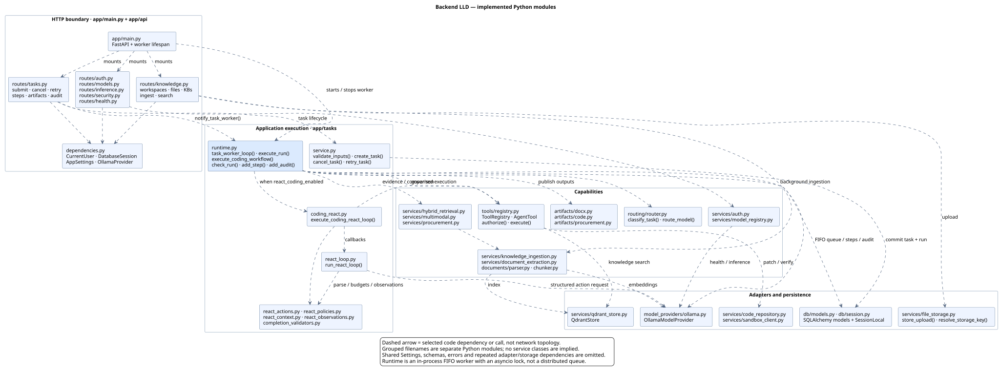
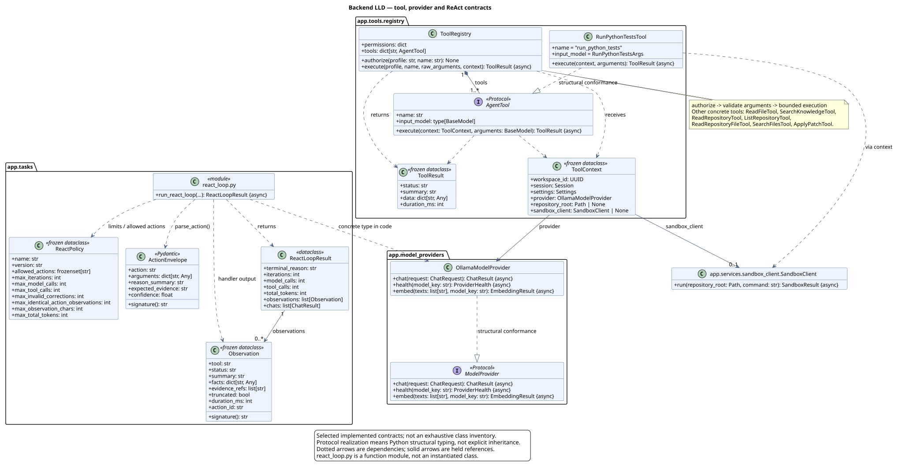
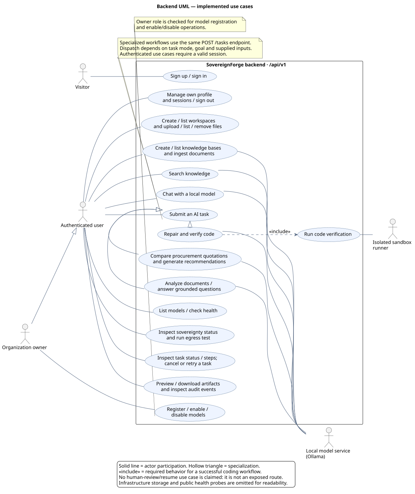

# Backend UML design

Implementation snapshot: 2026-09-18. These diagrams document the current `backend/app` code. The package proposal in [06-low-level-design.md](06-low-level-design.md) remains a design baseline; these views show the implemented module boundaries and selected contracts.

## Module dependency diagram



[Full-size SVG](uml/backend-modules.svg) · [PNG](uml/backend-modules.png) · [Editable PlantUML](uml/backend-modules.puml)

The boxes are Python modules or explicitly grouped files, not independently deployed services. Arrows identify selected imports and calls. Routes can access SQLAlchemy directly; the implementation does not have a separate repository layer. Shared configuration, schemas, errors and repeated storage dependencies are omitted to keep the diagram readable.

`main.py` starts an in-process worker. Task submission commits a task/run to the database before waking that worker. `runtime.py` drains queued runs, routes models, dispatches workflows, records steps/audit events and publishes artifacts. The worker lock is local to one process; this diagram does not imply distributed claiming or optimistic version checks.

The coding workflow calls `coding_react.py` when `react_coding_enabled` is enabled. That adapter supplies callbacks to `react_loop.py`, uses `ToolRegistry` for governed execution, and validates completion. The runtime also contains a non-ReAct coding path. Document retrieval, multimodal processing and procurement have their own service functions; they are not represented as separate ReAct agents.

## Class and contract diagram



[Full-size SVG](uml/backend-contracts.svg) · [PNG](uml/backend-contracts.png) · [Editable PlantUML](uml/backend-contracts.puml)

This view expands tool authorization, execution context/results, the model provider protocol, and bounded ReAct state. Python protocols are structural: concrete implementations do not need to inherit from them. The runtime and tool context currently reference `OllamaModelProvider` directly. The `react_loop.py` box has a `module` stereotype because `run_react_loop()` is a function, not a class method.

Artifact publishing uses functions in `artifacts/`; the proposed `ArtifactRenderer` protocol is not shown as an implemented class. The contract diagram is a focused subset, not an inventory of every ORM entity and Pydantic schema.

## Use-case diagram



[Full-size SVG](uml/backend-use-cases.svg) · [PNG](uml/backend-use-cases.png) · [Editable PlantUML](uml/backend-use-cases.puml)

The owner specializes the authenticated user and inherits those interactions. Model registration and enable/disable are owner-only; listing models and checking health require authentication. Workflow specializations share `POST /api/v1/tasks`. Code verification is required for a successful coding workflow, although failed validation can terminate a request earlier. Authentication is a precondition for protected interactions, not an included sign-in action on every request.

Task progress is read through HTTP status/step endpoints. There is no SSE route or human approval/resume route in the current backend. Generated approval recommendations are artifacts, not evidence that a human approval action occurred.

## Code traceability

| Diagram area | Implementation |
|---|---|
| App lifecycle and routing | [`main.py`](../backend/app/main.py), [`api/dependencies.py`](../backend/app/api/dependencies.py) |
| Task submission, ownership, cancellation and retries | [`api/routes/tasks.py`](../backend/app/api/routes/tasks.py), [`tasks/service.py`](../backend/app/tasks/service.py) |
| Queue, dispatch, steps, audit and artifact publication | [`tasks/runtime.py`](../backend/app/tasks/runtime.py) |
| Coding ReAct adapter and loop | [`tasks/coding_react.py`](../backend/app/tasks/coding_react.py), [`tasks/react_loop.py`](../backend/app/tasks/react_loop.py) |
| Actions, policies and observations | [`react_actions.py`](../backend/app/tasks/react_actions.py), [`react_policies.py`](../backend/app/tasks/react_policies.py), [`react_observations.py`](../backend/app/tasks/react_observations.py) |
| Tool protocol, concrete tools and policy gateway | [`tools/registry.py`](../backend/app/tools/registry.py) |
| Provider contract and implementation | [`model_providers/base.py`](../backend/app/model_providers/base.py), [`model_providers/ollama.py`](../backend/app/model_providers/ollama.py) |
| Workspace, file, ingestion and search use cases | [`api/routes/knowledge.py`](../backend/app/api/routes/knowledge.py) |
| Authentication and owner permissions | [`api/routes/auth.py`](../backend/app/api/routes/auth.py), [`api/routes/models.py`](../backend/app/api/routes/models.py) |
| Chat and sovereignty use cases | [`api/routes/inference.py`](../backend/app/api/routes/inference.py), [`api/routes/security.py`](../backend/app/api/routes/security.py) |
| Sandbox boundary | [`services/sandbox_client.py`](../backend/app/services/sandbox_client.py) |

## Editing and rendering

Edit the `.puml` sources, then regenerate both formats from the repository root with a local PlantUML JAR (validated with version 1.2024.8 and Java 17):

```sh
java -Djava.awt.headless=true -jar /path/to/plantuml.jar -failfast2 -tsvg docs/uml/*.puml
java -Djava.awt.headless=true -jar /path/to/plantuml.jar -failfast2 -tpng docs/uml/*.puml
```

The sources select the bundled Smetana layout engine, so a separate Graphviz installation is unnecessary. Rendering is local; no backend source is sent to an online diagram service. SVG is recommended for zooming and PNG for slides.
