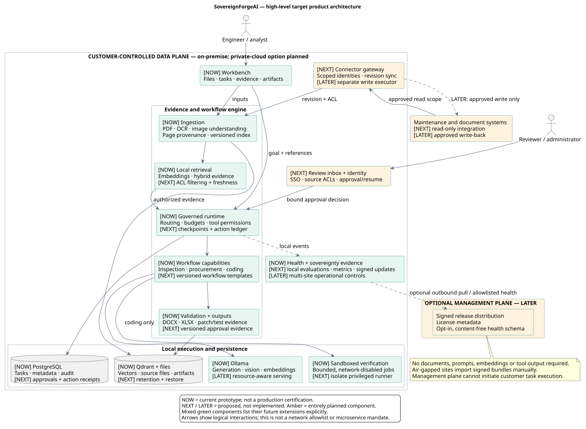

# SovereignForgeAI — product architecture and venture roadmap

Planning snapshot: 2026-09-18. **This is a proposed product direction, not a declaration that the roadmap has shipped.** It extends the existing SIH prototype without changing its code or current delivery scope. The venture thesis, customer profile, commercial model and pilot targets below are hypotheses to validate.

## Presentation assets

- [Minimal high-level software architecture PNG](uml/high-level-software-architecture.png) · [SVG](uml/high-level-software-architecture.svg) · [Editable PlantUML](uml/high-level-software-architecture.puml)
- [Editable PowerPoint: three architecture/roadmap slides](presentation/product-architecture/output/output.pptx)
- [Slide 1: high-level product architecture](presentation/product-architecture/scratch/slide-1.png)
- [Slide 2: proposed enterprise deployment](presentation/product-architecture/scratch/slide-2.png)
- [Slide 3: rollout and evidence gates](presentation/product-architecture/scratch/slide-3.png)
- [Detailed target architecture SVG](uml/product-target-architecture.svg), [PNG](uml/product-target-architecture.png), [editable PlantUML](uml/product-target-architecture.puml)

Use slide 1 in the main SIH pitch. Keep slide 2 for technical questions and slide 3 for the implementation plan. The detailed UML is a zoomable engineering appendix. The deck is an insertion pack for an existing pitch, not a complete investor presentation.

Legend: **NOW** means present in the repository or recorded prototype demonstrations; **NEXT** means proposed pilot work; **LATER** means expansion contingent on customer evidence. NOW does not imply production readiness, certification, independent validation or a new live test performed for this document.

## 1. Product thesis and first customer

**Pitch:** SovereignForgeAI helps industrial teams turn confidential inspection reports and maintenance procedures into cited decision packs on their own infrastructure. We are building the approval and integration layer that lets those reviewed decisions enter existing maintenance systems.

The first proposed customer is a maintenance or reliability team at an industrial site that reviews recurring inspection reports against approved SOPs. The daily user is an engineer; the budget owner is the maintenance/operations head; IT/security approves installation. Validate these roles through interviews before treating them as established buying behavior.

**Initial paid workflow:** inspection evidence + approved SOP → source-linked findings → draft maintenance recommendation → engineer review. The immediate artifact is a review pack, not an autonomous instruction to operate equipment. Human approval and CMMS write-back are future capabilities.

The SIH prototype can continue to demonstrate inspection, procurement and coding. The proposed commercial entry point is deliberately narrower: solve one recurring maintenance-review problem, then expand within the same account to procurement and controlled engineering workflows.

**Desired measurable outcome:** reduce the time spent assembling an acceptable maintenance review pack while preserving source accuracy and human accountability. Do not claim reduced downtime or avoided accidents without a study that supports causality.

## 2. High-level architecture

The logical path is **capture → understand → govern → execute → verify → deliver**. It runs inside a customer-controlled data plane. Deployment tooling, connectors and model engines remain replaceable behind clear interfaces; they are not separate microservices by default.

| Layer | Current implementation | Proposed product extension |
|---|---|---|
| Experience | Next.js workbench; tasks, models, knowledge, artifacts and sovereignty views | Review inbox, workflow templates, operational API; mobile capture only after demand |
| Identity and access | Local accounts, sessions, organization/workspace checks, owner-only model mutation | Enterprise SSO, role/action policy, document ACLs, service identities and revocation |
| Evidence ingestion | File upload, PDF/text extraction, OCR/multimodal services, versioned ingestion | Read-only CMMS/document connectors, sync cursors, quarantine and stale-source warnings |
| Knowledge | Local embeddings, Qdrant, bounded hybrid evidence and page provenance | Permission-aware hybrid retrieval, reranking, source lineage and revision invalidation |
| Workflow control | FastAPI modular monolith; database-backed task queue and one local executor | Durable approval/resume state, execution leases, tenant quotas, idempotent action ledger |
| Intelligence | Ollama, model health/capability routing; optional coding ReAct loop | Hardware admission control, workload budgets, eval-gated model releases; alternate serving engines when needed |
| Execution | Tool permissions and schemas, code sandbox, deterministic procurement logic | Connector action policies, dry-run previews, approved external writes and reconciliation |
| Outputs | DOCX/XLSX, patches/test evidence, artifact metadata and checksums | Versioned evidence packs, signed approval records, export policies and approved CMMS updates |
| Storage | PostgreSQL, Qdrant, local workspace files | Customer-managed encryption, object storage, tested backup/restore and retention jobs |
| Operations | Task/audit records, health and sovereignty probes, Compose isolation | Local metrics/tracing, tamper-evident audit, signed offline updates and recovery playbooks |

## 3. Deployment and trust boundaries

### Pilot: one customer installation

Keep FastAPI as a modular monolith and use a dedicated installation per customer. This provides a practical isolation boundary while the team validates demand. A customer may have several workspaces; workspace ownership checks alone must not be marketed as complete enterprise multi-tenancy.

Run browser/API ingress, application workers, metadata/vector storage, model serving and sandbox execution in distinct trust zones. The current Compose topology already separates several networks. Future deployment hardening must add TLS, identity integration, managed secrets and explicit service-to-service policies. A customer-owned private cloud installation is an optional deployment mode, not a requirement for operation.

Model inference, embeddings, documents, prompts, retrieved content and tool outputs remain within the customer data plane. Offline operation uses locally staged model and software bundles. Connected installations may allow specific enterprise endpoints through a connector gateway; connector access does not authorize public model calls or arbitrary internet access.

### Future management plane

An optional fleet service distributes signed release manifests and license metadata. A deployment agent pulls permitted updates; the management plane cannot initiate task execution or fetch customer documents. No customer content or embeddings are required for this service. Health telemetry is opt-in, schema-allowlisted, redacted and inspectable before transmission; air-gapped customers import signed bundles manually. Support bundles also require explicit export review.

### Sandbox boundary

The existing sandbox runner mounts the Docker socket, which is a privileged control surface. A production design must isolate that runner on a dedicated worker host or stronger runtime boundary and keep its control credentials away from model context. Candidate hardening includes short-lived signed jobs, read-only inputs, constrained output collection and per-job resource quotas. These are planned controls, not current security guarantees.

### Read/write separation for connectors

The first connector is read-only, chosen with the pilot customer. Future writes use a different scoped identity and a separate executor. The model can propose an action; it cannot approve it or choose new credentials. The system validates a typed action, resolves permissions, shows a diff, captures human approval and only then allows the write executor to act.

## 4. End-to-end maintenance workflow

1. A user uploads an inspection report and selects a versioned SOP. Later, a connector imports equivalent records with source ACLs and revision IDs.
2. Ingestion extracts pages, tables and image observations, preserves warnings and produces immutable source references. Missing pages and uncertain OCR remain visible.
3. Retrieval applies the authenticated principal's permissions **before** assembling model context. The future ACL design must apply to vector, lexical and cached retrieval paths equally.
4. The workflow chooses an eligible local model within a resource budget. Retrieved documents and instructions inside them are untrusted data; they cannot redefine tool policy.
5. The model proposes findings. Deterministic validators check schemas, citation resolution, required fields and workflow constraints. Failure produces a bounded retry, an incomplete result or a request for review.
6. The current product publishes a draft artifact. The planned review inbox binds an approval to the exact evidence version, proposed action, policy version and artifact digest.
7. If evidence or the proposed action changes, the old approval becomes invalid. A future write executor rechecks identity, permissions and target revision before updating the CMMS.
8. An action ledger records the request, idempotency key, external receipt and reconciliation state. Timeouts with unknown remote outcomes go to reconciliation; they must not blindly repeat an action.
9. Authorized reviewer corrections can create customer-local evaluation cases. Any cross-customer use requires a separate opt-in data agreement; confidential customer data is not a shared training asset by default.

## 5. Features worth adding, and why

| Priority | Planned capability | Customer value hypothesis | Evidence required to ship |
|---|---|---|---|
| NEXT | Evidence review inbox with source-page comparison | Engineers can review and correct findings quickly | Reviewers complete a full task without assistance; source references remain resolvable |
| NEXT | Approval/resume and signed action intent | Accountable handoff from recommendation to action | Expired/revoked/changed approvals cannot execute; duplicate resumes do not duplicate actions |
| NEXT | Read-only maintenance-system connector | Remove repeated manual uploads | Revision-aware sync, deletion/ACL propagation, recoverable outages and reproducible import |
| NEXT | SOP freshness and conflict checks | Prevent use of superseded or contradictory procedures | Evaluation fixtures catch stale revisions and expose unresolved contradictions |
| NEXT | Workflow quality and time-saved evaluation | Buyer can assess value using real work | Predefined baseline, blinded reviewer rubric, recorded failures and comparable documents |
| NEXT | Enterprise identity and source permissions | Fit the customer's access model | Denial tests across users, workspaces, search, downloads, caches and revoked sessions |
| LATER | Approved CMMS/ERP write-back | Reduce re-keying after review | Dry-run diff, approval binding, optimistic target revision and unknown-outcome reconciliation |
| LATER | Procurement and engineering template packs | Expand useful work within the account | Repeated usage and willingness to pay for each workflow; workflow-specific validation |
| LATER | Multi-site operations and resource scheduling | Roll out beyond one workstation | Concurrent load tests, isolation tests, restore drills and measured support cost |
| LATER | Local multilingual capture and document handling | Support actual site language needs | Named-language OCR/retrieval evaluation with domain reviewers; no blanket language claim |

Do not lead with autonomous plant control, unrestricted agents, a generic marketplace, a digital twin or a custom foundation model. Their implementation cost and new failure modes are not justified by the current entry workflow. They can be reconsidered only after a specific customer need and acceptance criteria exist.

## 6. Data and control model for future implementation

Add explicit entities to support the planned behavior: `SourceRevision`, `AccessGrant`, `WorkflowDefinitionVersion`, `RunCheckpoint`, `ActionIntent`, `ApprovalDecision`, `ConnectorCredentialRef`, `ConnectorActionReceipt`, `EvaluationCase` and `EvaluationResult`. These names are design proposals, not existing tables.

- Each run pins input revisions, workflow version, prompt/template version, model digest, policy version and reviewer-visible outputs.
- Each approval binds a reviewer, action digest, source revisions, expiry and authorization scope. Revocation is checked again immediately before execution.
- Connector secrets live in a customer-controlled secret store. Database rows hold references; prompts, tool observations and routine logs never contain credentials.
- PostgreSQL remains the source of truth. Vector indexes and caches are derived data, rebuilt from authorized source revisions.
- Cache keys include customer, principal/permission version, source/index version and model/config version. Permission changes invalidate affected entries.
- Retention/deletion jobs cover source blobs, extracted pages, embeddings, caches and artifacts. Audit retention and backup expiry need a customer-approved policy; deletion from active storage is not instant deletion from retained backups.
- Customer-local feedback becomes a versioned evaluation set with reviewer consent. Quality thresholds gate template/model updates and support rollback.

## 7. Scaling path and operational design

Separate worker processes when measurement shows API latency or queue delay is a problem. Before multiple workers claim jobs, implement atomic leasing, heartbeat expiry, retry budgets and idempotent output publication. Add an outbox for external effects and a dead-letter/reconciliation view for exhausted work.

Admission control uses document/page limits, model context budgets, queue depth and available inference capacity. Coding, OCR, embedding and generation have separate resource pools when contention warrants it. Prefer one model workload at a time on constrained pilot hardware; do not promise throughput from model size alone.

Only introduce a broker, specialized model server or orchestration cluster after the workload and operations team justify it. Deployment topology and worker count should be sized from measured concurrent users, pages per job, latency budgets and hardware utilization.

Proposed pilot operating targets: recovery point within 24 hours and restore within 4 hours, subject to customer agreement and a successful restore drill. Service uptime and latency commitments remain unset until a representative pilot load is measured. Record API latency, queue wait, workflow completion, citation validity, reviewer edits, sandbox denials and model memory pressure locally.

## 8. Delivery roadmap with exit gates

These are stages, not promised dates. Engineering effort should be estimated after customer access, team capacity and integration scope are known.

| Stage | Deliverable | Proposed exit gate |
|---|---|---|
| NOW — SIH prototype | Three documented synthetic workflows, local inference, evidence and artifacts | Fresh-machine rehearsal reproduces accepted outputs and exposes failures honestly |
| NEXT — design partner | One maintenance workflow, review inbox, source freshness and evaluation | Three pilot teams recruited; 30 comparable tasks reviewed; willingness to pay discussed |
| NEXT — paid pilot | SSO/ACLs as required, one read-only connector, approval state and restore procedure | Customer acceptance on access tests, quality, support and time saved; one paid pilot |
| LATER — repeatable rollout | Approved write-back, reusable templates, installation/update kit | A second customer installs using the same core product; support effort is measured |
| LATER — account expansion | Additional sites and validated workflow packs | Repeat weekly use, renewal/expansion evidence and sustainable delivery economics |

Proposed measurement gates for a maintenance pilot: at least 30 representative tasks across at least three reviewers, at least 30% median reduction in time to an accepted pack, at least 95% resolvable material citations, and zero unauthorized disclosures/actions in the defined negative-test suite. These are **targets, not achieved results**. Track quality errors separately; valid citations do not prove a claim is correct, and passing a finite security suite does not prove absence of vulnerabilities. Tune thresholds with the customer before collecting results, not after seeing them.

## 9. Business model and defensibility hypothesis

Start with a paid, bounded pilot for one site and one workflow. Proposed ongoing pricing is an annual software subscription per installation/site, with workflow scope and concurrency tiers, plus separately quoted deployment/support. The customer supplies or leases hardware. Exact prices require discovery; there is no revenue, pricing validation or market-size claim in this plan.

Measure deployment hours, support tickets/hours, update effort, inference resource cost and reviewer time saved. On-premise delivery can become a services business if each installation requires bespoke engineering; the second installation should prove that the product and playbook are reusable.

The defensibility hypothesis is the accumulation of evaluated workflow templates, reliable integrations, customer-local decision provenance and deployment know-how. Open models, RAG and an agent loop are useful components, but their presence does not establish a moat. Test differentiation against the buyer's actual alternatives: manual document review, a private chatbot, and existing maintenance-system automation.

Research market size bottom-up after choosing the segment: reachable sites × plausible annual contract × realistic adoption assumptions. Do not place an invented TAM or unnamed customer logos in the SIH or YC materials.

## 10. SIH demo and investor narrative

**Suggested 60-second architecture narration:**

> SovereignForgeAI turns confidential industrial documents into evidence-linked decision packs inside the customer's infrastructure. Our prototype already demonstrates inspection review, procurement comparison and sandboxed code repair using local models. Every workflow is governed by permissions and validation, with source references and artifacts available for inspection. We will start commercially with maintenance-review teams. The next milestone is a review inbox and a read-only maintenance-system connector, followed by approved write-back. That gives us a focused pilot where we can measure review time, output quality and repeat usage before expanding to other sites and workflows.

Show one inspection from upload to cited DOCX, open its source evidence, then show one recorded tool denial or sovereignty probe with its scope and timestamp. Keep procurement and coding as short expansion demonstrations. Present all roadmap capabilities with the NEXT/LATER labels visible. A generated approval document is not an implemented approval system.

For an investor discussion, bring verified customer interviews, a working demo, pilot usage, task-level quality/time measurements, an explicit buyer and evidence of willingness to pay. Team experience, actual traction and financing ask must be supplied by the founders; this document does not invent them. An architecture can support a credible pitch, but cannot promise SIH selection or YC acceptance.

This framing follows YC's guidance to explain the product plainly and show concrete progress, and its advice to launch, learn from users and avoid premature scaling. Sources: [How to Pitch Your Company](https://www.ycombinator.com/blog/how-to-pitch-your-company), [YC's Essential Startup Advice](https://www.ycombinator.com/blog/ycs-essential-startup-advice). The specific market entry, roadmap and thresholds above are our proposed strategy, not YC requirements or an endorsement.

## 11. Evidence and implementation references

- [Current backend UML](31-backend-uml-design.md) and [actual deployment configuration](../docker-compose.yml).
- [Recorded synthetic demo acceptance](30-presentation-dataset-build-record.md): includes successful run IDs, artifact checks and a later cold-start failure. No new performance or security acceptance run was performed while authoring this plan.
- [Current task runtime](../backend/app/tasks/runtime.py), [tool registry](../backend/app/tools/registry.py), [auth dependencies](../backend/app/api/dependencies.py), [owner model controls](../backend/app/api/routes/models.py).
- [Existing scaling plan](23-scaling-and-capacity-plan.md) and [ReAct engineering plan](29-react-and-loop-engineering-plan.md).

Where earlier proposal documents describe SSE, distributed claiming, fully abstracted providers or enterprise identity, inspect current code before labeling those features implemented. This plan is a future architecture supplement, not a silent replacement of the prototype baseline.
