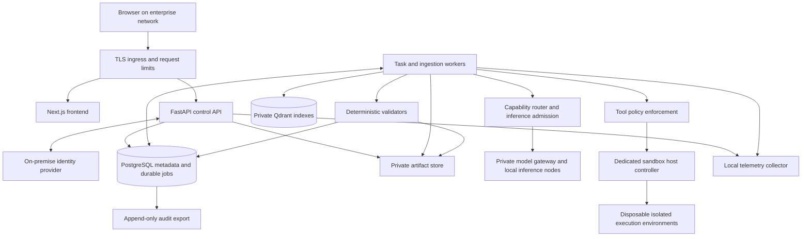

# System architecture

[Design index](README.md) · Status: proposed production architecture

## Conceptual architecture


The corrected order is **AI agent → model router → selected text, vision, or coding model**. The agent requests a capability; the router chooses an eligible model before inference. A workflow may route multiple calls, such as vision preprocessing followed by text reasoning.

This supplied diagram is conceptual. Interpret its direct model/data connections as mediated retrieval through application tools, not database credentials given to an LLM. “Code LLM (Execution)” means generating a candidate code change; execution happens only in the sandbox. “Verified code” means the specified checks passed. The model router does not authorize tools. Native model services, gateways, host administrators, and the sandbox control plane remain distinct trust boundaries.

## Production deployment topology



Proposed pilot deployment uses separately supervised services on private Linux hosts or VMs. Keep the application as a modular monolith with separate worker processes; introduce neither a service mesh nor Kubernetes as a pilot prerequisite. The sandbox host must be separated from the API/database host. A later HA profile can replicate APIs and add workers after distributed claiming and storage recovery are proven.

## Component responsibilities

| Component | Owns | Must not own |
|---|---|---|
| Control API | Authentication, authorization, validation, submission, status, review decisions | Long-running model jobs or Docker socket |
| Durable scheduler | Admission limits, claim leases, retry schedule, fairness | Model reasoning or arbitrary shell execution |
| Task worker | Frozen input manifest, routing, bounded workflow, evidence collection | Authorization overrides or unrestricted network access |
| Ingestion worker | Quarantine checks, extraction, chunks, staged embeddings | Activating partial indexes |
| Model gateway | Allowlisted inference methods, model digests, budgets, concurrency | File-system tools or caller-supplied upstream URLs |
| Tool gateway | Policy checks on each invocation, typed arguments, result limits | Trusting instructions found in documents |
| Sandbox controller | Fixed execution templates, isolated lifecycle, cleanup | Running on the application host with its data mounts |
| Validator/publisher | Structural and workflow checks, hashes, atomic publication | Treating another model’s opinion as conclusive validation |
| PostgreSQL | Authoritative job, permission, version, and review metadata | Large binary artifacts |
| Qdrant | Rebuildable, versioned retrieval index | Authoritative permission or lifecycle decisions |
| Private artifact store | Immutable file revisions and checksums | Public object URLs or cross-tenant deduplication APIs |

## Task execution contract

```mermaid
sequenceDiagram
    participant U as User
    participant A as API
    participant D as PostgreSQL
    participant W as Worker
    participant M as Router and local model
    participant T as Controlled tools
    participant R as Reviewer
    U->>A: Submit goal, file IDs, KB IDs, idempotency key
    A->>A: Authenticate, authorize every input, enforce quotas
    A->>D: Commit task, input snapshot, queued job, audit event
    A-->>U: 202 with task and run IDs
    W->>D: Atomically claim job with lease and fencing token
    W->>M: Select eligible model and invoke within budget
    M-->>W: Candidate response or tool proposal
    W->>T: Authorize and execute permitted action
    T-->>W: Bounded observations and validation evidence
    W->>D: Publish metadata only after artifact storage verifies
    A-->>U: Completed computation; draft ready for review
    R->>A: Approve or reject exact artifact revision
    A->>D: Record decision and audit event atomically
```

Inputs freeze file revision IDs, content hashes, knowledge index version, model digest, prompt/template version, policy version, and validator version. Freeze knowledge versions at submission; fail with an explicit version-unavailable error rather than silently substituting a newer index. Reauthorize inputs before execution and downloads; revoked access stops new execution even if the task previously passed submission checks.

Compute state and business approval are separate. Proposed run states: `queued → running → validating → completed`; terminal alternatives: `failed`, `cancelled`, `timed_out`. `cancel_requested` is a flag until execution actually stops. Artifact review states: `draft → in_review → approved | rejected`; any new revision requires new review. Approval never changes a failed run to a successful one.

## Distributed execution and recovery

Use a PostgreSQL job table initially. Claim with a short transaction using row locks and `SKIP LOCKED`, increment a fencing token, and commit before expensive work. Heartbeat a 60-second lease every 15 seconds; these are initial tuning values. All progress/final writes require the current token. Reclaim only expired leases, never reset every running job at API startup. The existing in-process lock is not a multi-worker guarantee.

Execution is at least once. An effect ledger keyed by `(run_id, logical_action_key)` prevents duplicate publication or sandbox launch reconciliation. A network timeout after dispatch is an unknown outcome: query the controller by execution ID before retrying. Bound retries by error category, attempt count, and original deadline; policy denials and invalid inputs do not retry automatically.

Use one active inference slot per low-memory node initially. Production scheduler owns shared slots; per-process semaphores alone do not limit multiple workers. Apply per-organization and per-workspace queue limits and fair scheduling. Extraction can use a separate bounded CPU pool. Scaling decisions follow measured queue wait, memory, and throughput.

## Failure and consistency decisions

| Failure | Required behavior |
|---|---|
| Worker terminates after claim | Lease expires, replacement reconciles effects and resumes/retries; stale worker cannot commit |
| Object written but DB commit fails | Object stays unreferenced; delayed orphan reconciler removes it only after grace period |
| DB reference exists but object missing | Integrity alarm; hide download and restore object; never return an empty success |
| Embedding or Qdrant write fails | Keep old index active; mark staged generation failed and retry safely |
| Model unavailable | Queue within deadline or fail clearly; use only policy-approved fallback and record it |
| Cancellation during generation | Interrupt where supported; prevent further tool calls/publication; reconcile sandbox stop |
| Source permission revoked | Deny further access, invalidate pending review eligibility, and record revocation outcome |
| Review races with new artifact revision | Compare expected revision and checksum; return conflict for stale decision |

## Deployment evolution

- **Development:** existing Compose/native Ollama; synthetic data, one executor.
- **Supervised pilot:** private TLS ingress, enterprise identity, durable workers, isolated sandbox host, encrypted backups, tested restore, one-site limits.
- **HA production:** redundant stateless API, database failover, replicated private storage, multiple scheduled inference nodes, tested zone/host failure.

Hardware is not fixed by this document. Benchmark model weights, context/KV memory, OCR, queueing, and concurrency on the candidate server before purchase. Keep the small-model profile for demonstrations while evaluating larger local models against the same datasets.
