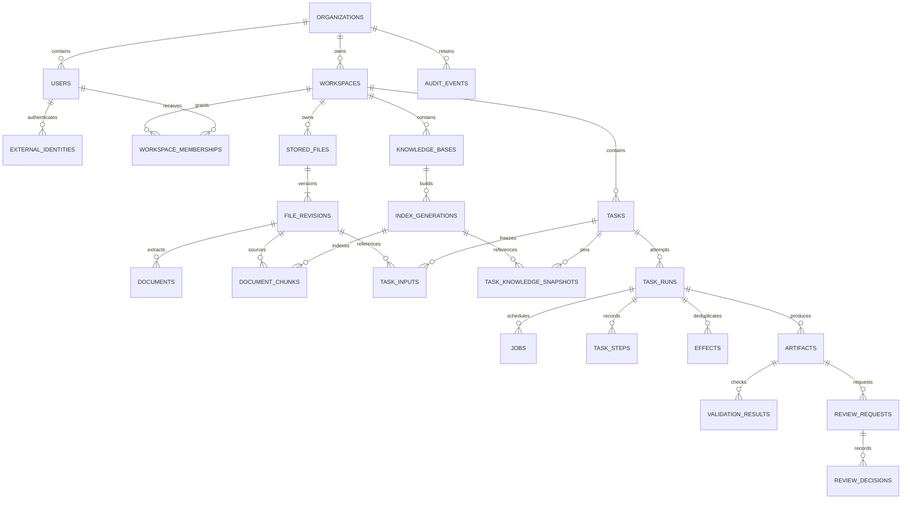

# Database and storage design

[Design index](README.md) · Existing schema and proposed migration plan; no migrations are executed by this document

## Authoritative stores

PostgreSQL owns identities, permissions, job state, versions, validation, reviews, and audit metadata. A private blob store owns immutable bytes. Qdrant is a rebuildable retrieval index, never the source of authorization truth. Model weights live in a separately managed local registry with immutable digests.

The pilot may use an encrypted, backed-up filesystem behind a blob-store interface. Multi-host workers require shared private storage with atomic finalization; select the organization's existing object service if available. Object-store selection and operational ownership are deployment decisions, not hidden runtime dependencies.

## Current schema inventory

Source: [SQLAlchemy models](../../backend/app/db/models.py) and [Alembic migrations](../../backend/alembic/versions).

| Current tables | Purpose | Production change |
|---|---|---|
| `organizations`, `users`, `auth_sessions` | Organization ownership, local identity, hashed sessions | External identities, scoped role assignments, enforced session revocation |
| `workspaces` | Organization work areas; nullable organization FK today | Make organization non-null after resolving legacy rows; membership and classification |
| `stored_files`, `documents` | Original bytes metadata and extraction | Explicit immutable revisions, scan status, retention, soft deletion |
| `knowledge_bases`, `knowledge_base_documents`, `document_chunks` | Versioned chunk membership and provenance | Index-generation registry and pinned embedding/model versions |
| `ingestion_jobs` | Ingestion status/progress | Durable lease-backed job linkage and restart recovery |
| `models`, `model_health` | Global model configuration and observations | Platform ownership, immutable model revisions, organization allowlists |
| `tasks`, `task_runs`, `task_steps` | Task intent, attempts, observations | Normalized input FKs, policy snapshots, leases, fenced writes, event cursor |
| `artifacts` | Run-owned output revision and checksum | Publication state, evidence manifest, validation records, review decisions |
| `audit_events` | Workspace/run audit payload | Retention independent from workspace/run deletion, restricted append/export |

Current weaknesses to resolve: file/knowledge IDs inside task JSON have no relational FK enforcement; task claiming has no database lease; multiple core relationships cascade deletion; audit events cascade with workspace/run deletion; global model registry administration is tied to organization ownership. These are schema/control gaps, not claims of an observed exploit.

## Target logical ER model

This is the proposed model. Existing tables remain where possible; new tables are additive before cutover.

## Proposed table contracts

All tenant-owned rows carry `organization_id NOT NULL`, UUID primary keys, UTC `timestamptz` timestamps, and appropriate workspace IDs. Every cross-resource FK includes tenant scope where applicable. Names below are design contracts awaiting Alembic implementation.

| Table/addition | Required columns and constraints |
|---|---|
| `external_identities` | `user_id`, `issuer`, `subject`; unique `(issuer,subject)`; never link accounts solely by unverified email |
| `workspace_memberships` | `organization_id`, `workspace_id`, `user_id`, `role`, `version`; unique `(workspace_id,user_id)`; same-org composite FKs |
| `file_revisions` | `file_id`, `revision`, `storage_key`, `sha256`, `size_bytes BIGINT`, `scan_status`, `classification`, `deleted_at`; unique `(file_id,revision)` and storage key |
| `index_generations` | `kb_id`, `version`, `embedding_digest`, `dimensions`, `chunker_version`, `status`, `manifest_hash`; unique `(kb_id,version)` |
| `task_inputs` | `task_id`, `file_revision_id`, `purpose`; unique `(task_id,file_revision_id,purpose)`; scoped FKs |
| `task_knowledge_snapshots` | `task_id`, `generation_id`; unique pair; pin exact retrieval generation |
| `model_revisions` | `model_id`, weight digest, license identifier/review, quantization, capability manifest, serving config hash; immutable |
| `organization_model_grants` | organization/model revision/profile allowlist; enabled flag; versioned administration |
| `policy_versions` | immutable policy document, hash, author, effective scope; referenced by runs |
| `jobs` | `kind`, typed owner FK, state, priority, available_at, lease_owner, lease_expires_at, fencing_token, attempts, deadline; enforce one owner and one active job per logical attempt |
| `effects` | `run_id`, `logical_action_key`, request hash, execution ID, state, result reference; unique `(run_id,logical_action_key)` |
| `validation_results` | artifact ID, validator/version, outcome, bounded details, checked_at; append-only |
| `review_requests` | artifact ID/revision/hash, requester, review role, status, version; at most one open request per artifact revision |
| `review_decisions` | request ID, actor, decision, reason, decided_at; unique terminal decision per request; immutable |
| `idempotency_records` | tenant, actor, route, key, request hash, response reference, expiry; unique scoped key |
| `outbox_events` | event ID, tenant, aggregate/version, payload schema, published_at; unique logical event; consumers deduplicate |
| `deletion_requests`, `retention_holds` | scoped subject FK, reason, actor, policy version, status, expiry; holds checked before purge |

Keep file ownership in `stored_files`; move byte/version properties into `file_revisions` gradually. `documents` becomes unique by `(file_revision_id, extractor_version)` instead of one document per mutable logical file. Only one generation may be active for a KB; use a pointer in `knowledge_bases` and a transaction to activate a fully built generation.

## Integrity and indexing

- Add CHECK constraints for legal states, nonnegative byte counts, attempts >0, lease coherence, and SHA-256 length/format. Use `NUMERIC` with explicit currency/rounding for procurement calculations, not binary floating-point money.
- Use composite uniqueness `(organization_id,id)` on referenced tenant tables and composite child FKs. RLS does not replace referential integrity or workspace permission checks.
- Keyset list indexes: `(organization_id,workspace_id,created_at DESC,id DESC)` on tasks, files, artifacts. Steps: unique `(run_id,sequence)`. Audit: `(organization_id,occurred_at,id)` and scoped event-type/time index.
- Jobs: partial index on `(available_at,priority,created_at,id)` for queued work, plus lease-expiry index for running jobs. Claim query/index must be profiled with realistic distributions.
- Retain unique task attempt and artifact logical-name/revision constraints; add one-active-attempt invariant and compare-and-swap version checks.
- Index JSONB only for demonstrated query needs. Large raw model/tool output belongs in restricted blob storage with bounded preview, not frequently scanned rows.
- Partition audit and step history by time only after measured volume justifies maintenance overhead; retention jobs must respect holds and referential requirements.

## Tenant isolation

Application authorization resolves the principal and workspace grant before data access. Add PostgreSQL row-level security as defense in depth using transaction-local tenant context, set by trusted server code and reset by transaction end. Missing context denies access. Runtime DB roles must not own protected tables or possess `BYPASSRLS`; migration and backup roles are separate. Test pooled connections for leaked context. PostgreSQL documents owner/superuser bypass behavior in its [row-security reference](https://www.postgresql.org/docs/current/ddl-rowsecurity.html).

Background workers set tenant context from a trusted claimed job, not arbitrary task JSON. A narrowly scoped scheduler role can claim job metadata across tenants but cannot read business content; tenant workers obtain only the scoped work context. Logs must not expose another tenant's existence through counts or queue position.

Qdrant payload includes organization, workspace, KB, generation, document revision, chunk ID, and content hash. Server-generated filters are mandatory, and returned chunks are rechecked against PostgreSQL visibility. Reindex into a new generation when embedding model/dimensions change. Never query incompatible vectors or use client-supplied filter expressions directly.

## Publication and cross-store consistency

1. Write artifact to an unguessable staging key, stream bounded bytes, and calculate checksum.
2. Run validators and record their versions; failed outputs remain quarantined with restricted retention.
3. Finalize immutable bytes and confirm read/checksum before committing `published` metadata and outbox event in PostgreSQL.
4. Download only `published` rows with existing verified objects and current permission. Review approval is a separate state.
5. A reconciler detects orphan objects and missing objects; deletes only eligible orphans after a 24-hour provisional grace period and retention checks.

No distributed transaction is assumed across PostgreSQL, storage, and Qdrant. Staging, immutable IDs, retries, and reconciliation provide recoverable consistency.

## Retention and deletion

Proposed pilot defaults awaiting data-owner approval: rejected upload bytes 24 hours; debug/model observations 7 days; operational logs 30 days; source revisions and artifacts 90 days; audit and decisions 365 days. These are configurable operational choices, not legal retention requirements. Holds override scheduled deletion.

Deletion first revokes visibility, cancels dependent queued work, and marks a tombstone. An authorized purge job removes eligible blob bytes, normalized extraction, vector points, cached previews, and then records completion. Retain minimal non-content audit tombstones where policy permits. Backups age out under their own schedule; restore must replay deletion tombstones before reopening access. Do not promise immediate erasure from retained backups.

Replace destructive cascades on retained evidence with RESTRICT or nullable identity references plus immutable actor/resource snapshots. Organization removal is a reviewed retention workflow, never a single cascade delete.

## Migration sequence and rollback

1. **Inventory:** backup/restore rehearsal, orphan/null-tenant reports, volume and query baseline; unresolved ownership rows remain quarantined.
2. **Expand:** add nullable tenant/revision columns and new tables; no destructive changes. Run migration job once, not in every API replica startup.
3. **Backfill:** resumable batches with checkpoints, checksums, same-org validation, and observed row counts. Never invent tenant ownership for ambiguous legacy rows.
4. **Dual-write:** write normalized references and legacy JSON in one DB transaction; compare reads in shadow mode.
5. **Constrain:** validate FKs/checks, build indexes with an appropriate nonblocking strategy, set non-null, test RLS under runtime roles.
6. **Cut over:** switch reads behind a deployment flag; monitor authorization failures, consistency, and latency.
7. **Contract:** remove legacy fields only after one rollback window and compatible backup. Destructive migration needs an explicit reviewed deployment action.

Rollback before contraction uses the old binary and intact legacy fields. After contraction or incompatible data transformation, restore into a separate environment or forward-fix; do not assume Alembic downgrade recovers deleted information.

## Recovery validation

Restore PostgreSQL and blobs to a consistent documented point, verify every published reference and hash, rebuild or restore pinned Qdrant generations, reconcile jobs/effects, replay deletion tombstones, rotate recovery credentials, then run isolation and workflow smoke tests. See [operations](operations.md) for RPO/RTO, schedule, and owners.
